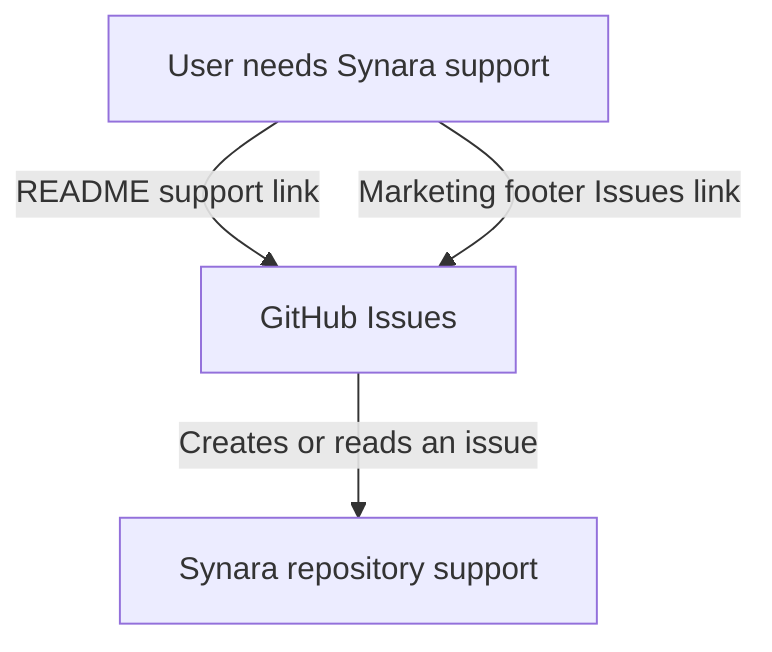

# Recap: Discord Support Link

> Generated: 2026-07-13 | Scope: 3 files

---

## Summary

The public support links incorrectly sent Synara users to the `t3-code-discussion` channel in Theo's Discord server. The README and marketing footer now direct users to Synara's GitHub Issues page, the project's active support surface.

---

## Files Affected

| File                                      | Status      | Role                                                           |
| ----------------------------------------- | ----------- | -------------------------------------------------------------- |
| `README.md`                               | ✏️ Modified | Replaces the incorrect Discord support link with GitHub Issues |
| `apps/marketing/src/layouts/Layout.astro` | ✏️ Modified | Replaces the website footer's Discord link with an Issues link |
| `docs/RECAP-discord-support-link.md`      | ✅ Created  | Documents the support-link correction                          |

---

## Logic Explanation

### Problem

Both public Discord links used invite `jn4EGJjrvv`, which belongs to Theo's Typesafe Cult and opens its `t3-code-discussion` channel. No Synara-owned Discord invite exists elsewhere in the repository, so presenting that destination as Synara support was misleading.

### Approach

The links were replaced with the repository's GitHub Issues page because Issues is enabled, active, and already part of Synara's contribution workflow. The marketing footer derives the destination from the existing `REPO_URL` constant so the repository address remains centralized.

### Step-by-step

1. A user looking for help in `README.md` is invited to open a GitHub issue.
2. A visitor selecting `Issues` in the marketing footer is sent to the same repository support page.
3. Neither public entry point references the unrelated Discord server anymore.

### Tradeoffs & Edge Cases

GitHub Issues is less conversational than Discord, but it is the only verified Synara-owned support surface currently available. If a dedicated Synara Discord server is created later, both links can be updated to its permanent invite.

---

## Flow Diagram

### Happy Path

---

## High School Explanation

The old sign said “Synara help,” but it pointed into somebody else's club room. We changed both signs so they now point to Synara's own GitHub Issues page, where users can report a problem or ask for help without ending up in the wrong community.
