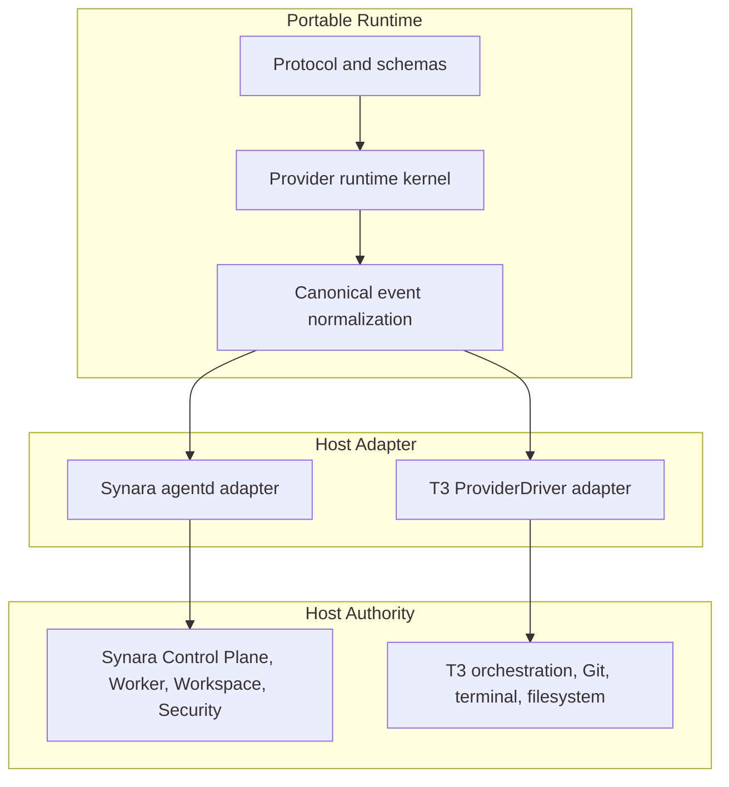
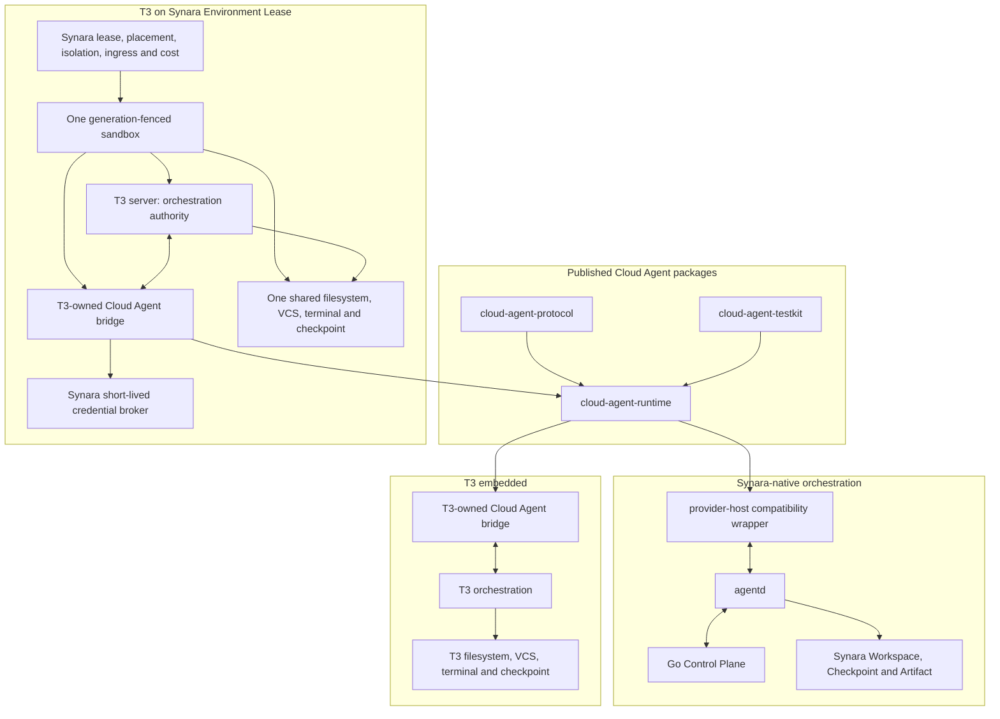
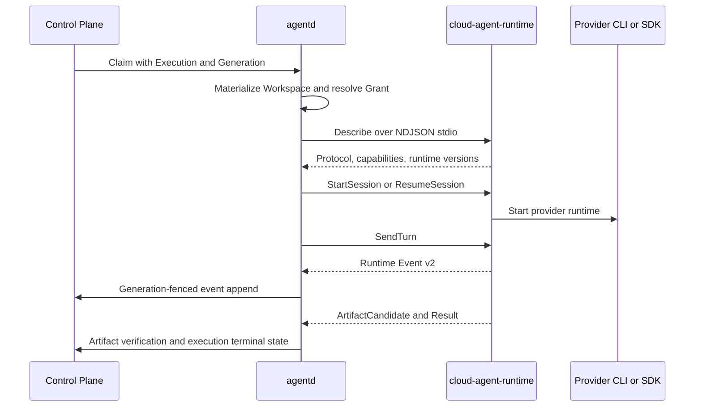
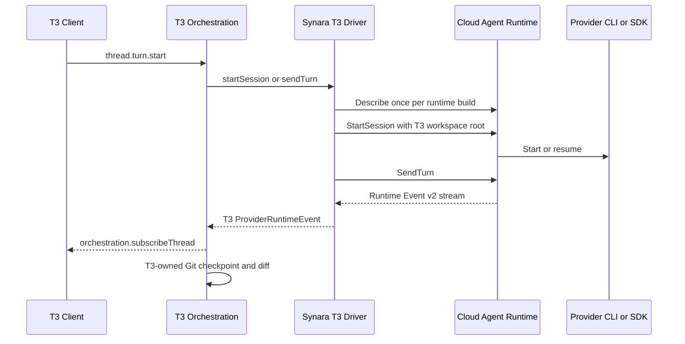
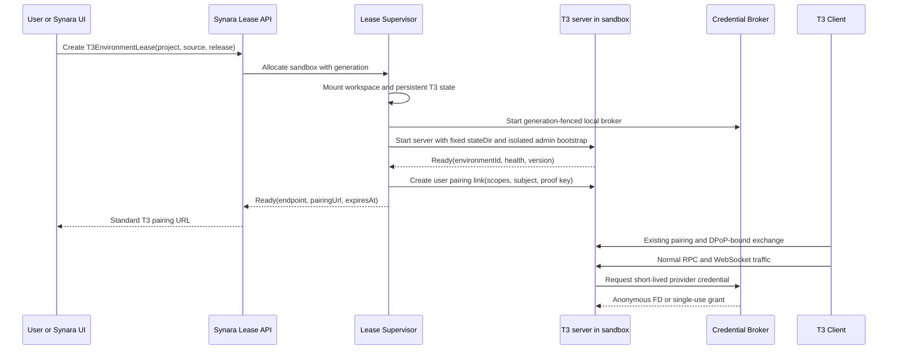

# Synara × T3 Cloud Agent 插件化集成设计

- 设计状态：TARGET FROZEN（目标架构、authority 和主路径已确认；变更需新增 ADR）
- 实施状态：IN PROGRESS（M0 open；M1 Phase 1–3 hardened source 已合入；发布、真实 Provider Turn 与长稳验收门禁尚未完成）
- 发布状态：NOT PUBLISHED / NOT DEPLOYED
- 日期：2026-08-08
- 确认日期：2026-08-08
- 实施更新：2026-08-09
- 目标宿主：Synara、[T3 Code](https://github.com/pingdotgg/t3code)
- Synara 基线：`codex/saas-tenancy-user` @ `fc9f63ac74eeb04cf201506972878ac15307a0e4`
- T3 Code 初次调研基线：upstream `main` @ [`a20923ce463335e89e92f5983d98a180536e8e7d`](https://github.com/pingdotgg/t3code/tree/a20923ce463335e89e92f5983d98a180536e8e7d)
- T3 Code hardening 基线：upstream `main` @ [`1a003e383ac6b10258b8100c2617d938c4f06c69`](https://github.com/pingdotgg/t3code/tree/1a003e383ac6b10258b8100c2617d938c4f06c69)
- T3 Code 本地跟踪目录：`/Users/huang/devel/project/huang/business/t3code`
- Synara hardening worktree：`/Users/huang/devel/project/huang/business/synara-cloud-agent-hardening`
- T3 Code hardening worktree：`/Users/huang/devel/project/huang/business/t3code-cloud-agent-hardening`
- hardening source commit：Synara `f9fb3d695c3188a1878475986133ffee64d8befc`；T3 Code `e449555de9a31b1988e8c05c2f577eeb88518c30`
- 当前已验证代码基线：Synara `codex/saas-tenancy-user` @ `8df69a72e8708d9a725af6743bc76f94ab7defc6`；
  T3 Code `origin/codex/saas-tenancy-user` @ `6b5b4a501a084efb2b7e3b5a110e2196238336a6`

> 本文同时记录目标设计和当前隔离 worktree 的 source implementation 与 local validation evidence。
> `TARGET FROZEN` 表示不再改变公共
> Runtime、双宿主 authority 和 `T3EnvironmentLease` 的方向；`IN PROGRESS` 只表示源码骨架、定向测试和
> 本地构建达到附录 A 记录的边界，不表示 M0/M1 已验收，也不表示已发布、部署、完成真实
> Provider 付费 Turn，或达到 public beta/GA。每次推进 T3 Code commit 仍必须复核 Provider SPI。

## 0. 结论先行

实仓复核后，建议把方案收敛为**一个可移植 Runtime、两种宿主编排方式、一个完整云环境产品**，
而不是把“插件包”理解为一个可以直接 import 到任何 Agent GUI 的 T3 `ProviderDriver`。

1. 把现有 `@synara/provider-host` 提炼成无宿主依赖的 `@synara/cloud-agent-runtime`；
2. 把 Provider Host Protocol v2.2 基线、additive v2.3 `GenerateText`、Runtime Event v2、能力目录和
   错误语义提炼成稳定的 `@synara/cloud-agent-protocol`；
3. 把 Codex/Claude 提取成基于 `@synara/cloud-agent-provider-api` 的通用 Provider 包，不放在
   Runtime 的宿主私有子路径；
4. 公共 ABI 只暴露普通 JS/stdio 协议，不暴露 T3 或 Synara 的 Effect 类型；
5. T3 第一版由 **T3 仓内薄桥接 Driver** 调用 Runtime。该桥接属于 T3 构建，不把 T3 当前内部
   `ProviderDriver` 冒充成稳定的第三方插件 SDK；
6. T3 使用 Synara 云算力的正式形态，不是“本地 T3 + 远程 Provider”，而是 Synara 创建一个
   `T3EnvironmentLease`，让 T3 server、Provider Runtime、Workspace、Git、Terminal 和 checkpoint
   位于同一 sandbox；
7. T3 Client 通过现有 pairing/connection 模型连接该 T3 server，managed 模式使用 DPoP-bound
   exchange；pairing token 只作为一次性短期 bootstrap credential，不能直接访问业务 API；第一版不新增 `SynaraConnectionTarget`，
   不改 Web/Desktop/Mobile 的连接模型；
8. Synara-native 模式继续由 Control Plane 拥有 Session/Turn/Execution；T3-on-Synara 模式则由
   T3 server 拥有 Thread/Turn/Checkpoint。两种模式复用 Runtime，不共享同一份编排权威；
9. `delegated-control-only` 只保留为后续实验/观察入口，不进入第一批正式交付，因为 T3 当前没有
   足够的 Workspace/Terminal/VCS capability 开关来安全降级。

目标交付拓扑如下；这是 M1/M2 目标，不是当前 source implementation 的物理依赖图：

```text
发布包
├── @synara/cloud-agent-protocol     # 稳定、app-neutral
├── @synara/cloud-agent-provider-api # 通用 Provider Plugin ABI；无 Effect/宿主类型
├── @synara/cloud-agent-runtime      # 通用装载/会话内核；out-of-process 优先
├── @synara/cloud-agent-provider-codex
├── @synara/cloud-agent-provider-claude
├── @synara/cloud-agent-testkit      # 双宿主 conformance
└── @synara/cloud-agent-distribution # managed release 必需：manifest、bin、校验和；不导出 T3 内部 SPI

Synara 构建
├── @synara/provider-host            # 兼容壳
├── agentd adapter
└── T3EnvironmentLease controller    # 后续新增的云环境产品面

T3 构建/薄 fork
├── SynaraCloudAgentDriver.ts        # T3-owned Effect bridge
├── SynaraCloudAgentTextGeneration.ts
├── contributedDrivers.ts            # 显式 composition seam
└── @synara/cloud-agent-distribution # 固定 Runtime + Provider 包版本和 digest
```

### 0.1 收拢后的唯一目标与主路径

**唯一目标**：先把 Codex/Claude 的单一实现物理拆入七个可发布、app-neutral 包，并让 Synara 与 T3
Embedded 通过同一套进程级 conformance；随后只把同一 T3 bridge 连同完整 T3 server 部署进
generation-fenced `T3EnvironmentLease`，以 `create → ready → terminate` 作为首个云 MVP。

```text
M0 基线与兼容证据
  ↓
M1 Portable Runtime RC + T3 Embedded 验收（当前唯一近程里程碑）
  ├── M1 Release Gate → RC → 可选 G-EXPOSURE
  └── M2 T3 Environment Lease MVP（完整 T3 server 同 sandbox）
        └── M2 Release Gate → RC → 可选 G-EXPOSURE
```

| 轨道                               | 目标与退出条件                                                                 | 当前状态                                  |
| ---------------------------------- | ------------------------------------------------------------------------------ | ----------------------------------------- |
| M0 基线                            | golden frames、真实 Codex/Claude happy/failure path、前后行为可比较            | 未完成真实 Provider 路径                  |
| M1：Phase 1–3                      | 七个包 + T3 thin bridge + Synara 兼容壳 + 双宿主进程级 conformance + 不可变 RC | source implementation in progress，未验收 |
| M2：Phase 4                        | Lease、同 Workspace、pairing/DPoP、generation/broker、RBAC、计量、审计         | 未开始                                    |
| Release M1 / M2                    | 各自 exact pin、外部 install/rollback、digest/provenance/SBOM                  | M1 open；M2 not started                   |
| G-EXPOSURE                         | 每个 RC 独立批准用户范围、支持等级、channel、回滚与事故响应                    | not started                               |
| Deferred D1：Suspend/Resume        | quiesce、SQLite/Workspace 一致快照、新 generation resume                       | 不阻塞 M2 MVP                             |
| Deferred D2：Generic UX / upstream | composition seam、server-advertised descriptor、generic UX、小型 upstream PR   | 不阻塞 M1/M2                              |
| Deferred D3：Polaris delegated     | control-only 产品需求与全套 Workspace capability 降级                          | 默认关闭                                  |
| Deferred D4：生态扩展              | 其他 Provider、动态目录/市场、公共 T3 Provider SDK                             | 不进入首批范围                            |

M1 未通过前可以做 M2 原型设计，但不能把 Environment Lease 标为受支持产品；M2 不依赖 D1/D2/D3/D4。M1
必须生成可验证的内部 Distribution candidate，M2 只消费其不可变 digest；公开 Registry 发布与上游接受是
独立 exposure 决策，不能反向阻塞架构验证。

本文中，**Distribution candidate** 是带固定内容与待签 release manifest 的内部不可变制品；**RC** 是已
关闭对应工程 Gate、可提交发布评审的 candidate；**exposure** 是经产品/运维批准后向指定用户范围提供支持，
公开 npm/Registry 只是 exposure channel 之一。工程里程碑完成、RC 形成和公开 exposure 不互相冒充。

文档发生冲突时按以下顺序解释：本节与第 22 节的确认决策 → 第 4/17/19 节的目标和门禁 → 附录 A 的
时点证据。附录 A 只能证明当前进度，不能修改目标或提升发布状态。

### 0.2 本次 T3 Code 实仓复核带来的修正

| 实际源码事实                                                                                                                                                    | 对原设计的修正                                                                                     |
| --------------------------------------------------------------------------------------------------------------------------------------------------------------- | -------------------------------------------------------------------------------------------------- |
| `ProviderDriver` 虽是 record，但它的 config decoder、`create()`、`ProviderInstance`、adapter 和 text generation 都直接使用 T3 内部 Effect/contract/service 类型 | 公共包不能直接稳定导出 T3 Driver；必须有 T3-owned bridge                                           |
| `BUILT_IN_DRIVERS`、`BuiltInDriversEnv` 和 Registry Hydration 静态绑定                                                                                          | “安装包 + import + 数组一项”低估了类型环境、Layer 注入和 hydration 改动                            |
| `ProviderDriverKind` 与 `providerInstances.config` 是开放 envelope，未知 driver 可以 round-trip                                                                 | Server settings contract 无需为 Synara driver 改 schema，这是可利用的稳定点                        |
| 设置页的 provider metadata、添加向导和 settings schema 仍由前端静态列表定义                                                                                     | 薄 fork 第一版必须补静态 metadata/config schema；后续改为 server-advertised driver descriptor      |
| `turn.diff.updated` 只创建 missing placeholder；`CheckpointReactor` 随后读取本地 cwd、捕获本地 Git ref 并生成真正 diff                                          | 远端 Provider 事件不能成为当前 T3 的权威 diff；单加 `CheckpointAuthority` 不足以完成远端 Workspace |
| T3 的远程架构明确规定一个 server 同时拥有 provider、orchestration、terminal、git 和 filesystem                                                                  | 正式云集成应移动完整 T3 server，而不是拆开 T3 runtime                                              |
| 现有 `BearerConnectionTarget` 能配对任意可达 T3 endpoint                                                                                                        | Synara 只需返回标准 pairing URL，不需要新增连接类型和四端适配                                      |

复核证据：

- [`ProviderDriver.ts`](https://github.com/pingdotgg/t3code/blob/a20923ce463335e89e92f5983d98a180536e8e7d/apps/server/src/provider/ProviderDriver.ts)；
- [`builtInDrivers.ts`](https://github.com/pingdotgg/t3code/blob/a20923ce463335e89e92f5983d98a180536e8e7d/apps/server/src/provider/builtInDrivers.ts) 与
  [`ProviderInstanceRegistryHydration.ts`](https://github.com/pingdotgg/t3code/blob/a20923ce463335e89e92f5983d98a180536e8e7d/apps/server/src/provider/Layers/ProviderInstanceRegistryHydration.ts)；
- [`providerInstance.ts`](https://github.com/pingdotgg/t3code/blob/a20923ce463335e89e92f5983d98a180536e8e7d/packages/contracts/src/providerInstance.ts)；
- [`ProviderRuntimeIngestion.ts`](https://github.com/pingdotgg/t3code/blob/a20923ce463335e89e92f5983d98a180536e8e7d/apps/server/src/orchestration/Layers/ProviderRuntimeIngestion.ts) 与
  [`CheckpointReactor.ts`](https://github.com/pingdotgg/t3code/blob/a20923ce463335e89e92f5983d98a180536e8e7d/apps/server/src/orchestration/Layers/CheckpointReactor.ts)；
- [`remote.md`](https://github.com/pingdotgg/t3code/blob/a20923ce463335e89e92f5983d98a180536e8e7d/docs/internals/remote.md) 与
  [`connection/model.ts`](https://github.com/pingdotgg/t3code/blob/a20923ce463335e89e92f5983d98a180536e8e7d/packages/client-runtime/src/connection/model.ts)；
- [`providerDriverMeta.ts`](https://github.com/pingdotgg/t3code/blob/a20923ce463335e89e92f5983d98a180536e8e7d/apps/web/src/components/settings/providerDriverMeta.ts) 与
  [`ProviderInstanceCard.tsx`](https://github.com/pingdotgg/t3code/blob/a20923ce463335e89e92f5983d98a180536e8e7d/apps/web/src/components/settings/ProviderInstanceCard.tsx)。

因此，“插件化”的稳定边界应当放在 **Cloud Agent Runtime 进程协议**，而不是当前 T3 内部的
TypeScript SPI；“云端化”的稳定边界应当放在 **T3 Execution Environment 租约**，而不是远程
Provider Adapter。

## 1. 为什么不能直接复制一份代码

### 1.1 两个项目看起来相近，但权威边界不同

T3 Code 当前是一个本地或远程部署的单体执行环境：一个 T3 server 持有 Provider 进程、项目目录、
Git、Terminal、Checkpoint 和线程状态，客户端通过 Effect RPC WebSocket 连接。它目前已经具备：

- 开放字符串形态的 `ProviderDriverKind`；
- `ProviderDriver` → `ProviderInstance` → `ProviderAdapter` 的驱动模型；
- 运行时实例注册、配置解码和 Scope 生命周期；
- Provider Runtime Event → event-sourced orchestration 的投影；
- Web、Desktop、Mobile 共享同一服务端执行边界。

相关当前源码：

- [T3 Code Architecture](https://github.com/pingdotgg/t3code/blob/a20923ce463335e89e92f5983d98a180536e8e7d/docs/internals/overview.md)
- [Provider architecture](https://github.com/pingdotgg/t3code/blob/a20923ce463335e89e92f5983d98a180536e8e7d/docs/internals/providers.md)
- [`ProviderDriver.ts`](https://github.com/pingdotgg/t3code/blob/a20923ce463335e89e92f5983d98a180536e8e7d/apps/server/src/provider/ProviderDriver.ts)
- [`ProviderAdapter.ts`](https://github.com/pingdotgg/t3code/blob/a20923ce463335e89e92f5983d98a180536e8e7d/apps/server/src/provider/Services/ProviderAdapter.ts)
- [`providerInstance.ts`](https://github.com/pingdotgg/t3code/blob/a20923ce463335e89e92f5983d98a180536e8e7d/packages/contracts/src/providerInstance.ts)

Synara 的 Cloud Agent 则是分布式权威模型：

- Go Control Plane 持有 Tenant、Project、Session、Turn、Execution 和幂等权威；
- Target、Pool、Worker、Generation 决定执行位置与 fencing；
- `agentd` 持有 Worker 身份、Workspace 物化、凭证 Grant、Artifact 上传和恢复；
- Provider Host 只负责 Provider 会话、Turn 和标准化事件；
- gVisor/Cocoon、Credential Grant、KMS、RBAC、Audit、Billing、DR 等属于平台权威。

因此，可移植层只能覆盖两边的交集：**Provider Runtime + Session/Turn 控制 + 标准事件**。分布式
调度、租户隔离和平台治理不能假装是一个本地 npm 插件能够复制的能力。

### 1.2 “本地 T3 + 远程 Provider”有 Workspace 双权威问题

如果只在 T3 Code 里新增一个调用 Polaris API 的 Provider Adapter：

```text
T3 server（本机）                 Synara Worker（远端）
├── 本地 Project/Workspace A     ├── 远端 Workspace B
├── 本地 Git Checkpoint          ├── agentd Checkpoint
├── 本地 Terminal                ├── Provider Host 修改 B
└── 远程 Provider Adapter ──────►└── Session / Turn
```

聊天流可以工作，但会产生以下错误体验：

- Agent 改了远端 B，T3 文件树仍显示本地 A；
- T3 的 Turn checkpoint 捕获 A，远端 diff 来自 B；
- T3 Terminal 操作 A，Agent 命令运行在 B；
- Revert、Fork、Rollback 可能同时由两边执行；
- 用户看到“完成”，但当前可视目录没有那些文件。

因此本文把正式路径明确分为 `t3-embedded` 和 `t3-environment-lease`；另把
`delegated-control-only` 隔离为默认关闭的实验路径，不允许用同一个模糊的 `remote=true` 掩盖差异。

### 1.3 Effect 不能成为插件 ABI

当前 Synara 使用自有固定提交的 Effect 4 beta，T3 Code 基线使用 `effect@4.0.0-beta.103`。即便
TypeScript 接口形状相似，跨包直接暴露 `Effect.Effect`、`Layer`、`Context.Service` 或品牌类型，
也会造成：

- 双份 Effect runtime；
- 类型参数和 Service Tag 不兼容；
- 宿主升级被插件锁死；
- 一个项目的内部依赖进入另一个项目的公共 ABI。

所以公共插件 ABI 必须是普通 TypeScript/JavaScript：`Promise`、`AsyncIterable`、`AbortSignal`、
纯 JSON 值和结构化错误。两个宿主在适配层内各自转换到自己的 Effect 版本。

## 2. 目标与非目标

### 2.1 目标

1. Cloud Agent Runtime 的同一份实现能够被 Synara `agentd` 和 T3 Code Provider Driver 调用。
2. 保留 Provider Host Protocol v2.2 既有命令与 Runtime Event v2 语义；首批以 additive minor 2.3
   增加 `GenerateText`，不得破坏 2.2 golden frame 的读取与既有命令语义。
3. T3 Code 集成只复制宿主桥接，不复制 Provider 实现；薄 fork 的补丁面有明确文件预算和跟踪基线。
4. Synara 集成保持 `apps/provider-host`、Worker 镜像和 `agentd` 现有行为兼容。
5. Runtime 不知道 Tenant、Kubernetes、gVisor、Cocoon、T3 RPC 或任何 UI 状态。
6. 每种运行模式只有一个编排权威和一个 Workspace/VCS/Checkpoint 权威；环境平台与 Agent 编排的
   所有权分别建模。
7. Provider 能力必须运行时协商，不能因宿主 UI 有按钮就假设 Provider 支持。
8. 重启、断流、重复命令和乱序事件必须有确定行为。

### 2.2 非目标

- 不把 Synara Control Plane 改写成 TypeScript。
- 不把 Tenant/RBAC/Billing/Audit/Worker Pool 塞进插件。
- 不在第一阶段设计插件市场或自动下载第三方可执行文件。
- 不让插件直接获得宿主数据库连接。
- 不把 MCP 当成 Agent Session 生命周期协议；MCP 仍用于工具发现与调用。
- 不承诺 T3 Code 上游会接受该插件；先做可维护的薄集成，再准备上游化。
- 不把“在 T3 Code 能聊天”描述为完整的 Cloud Workspace 集成。

## 3. 可移植 Cloud Agent 的领域边界

### 3.1 一个 Cloud Agent Runtime 应该负责什么

```text
CloudAgentRuntime
├── Describe / capability negotiation
├── Start / resume / stop Provider session
├── Send / steer / interrupt / suspend Turn
├── Approval / structured user input
├── Compact / review / provider-history rollback / fork
├── Provider-native cursor and authoritative-history reconstruction
├── Canonical Runtime Event v2 projection
├── Provider process lifecycle and bounded backpressure
└── Stable, redacted error classification
```

### 3.2 Runtime 明确不负责什么

```text
HostAuthority
├── Workspace create/materialize/mount/cleanup
├── Git checkpoint and workspace rollback
├── Artifact physical storage and signed grants
├── Credential authorization and secret lifecycle
├── Tenant/Organization/Project authorization
├── Worker placement, warm pool and scheduling
├── Generation/lease/workload identity fencing
├── container/gVisor/microVM isolation
├── cost, quota, audit, retention and DR
└── UI, RPC, database and client connection
```

### 3.3 “Cloud Agent”不是单一进程

产品概念应拆为三个同心层：



Polaris `delegated-control-only` 属于 Deferred D3 的替代 backend，不是第三种主路径 Host Adapter，也不进入
核心拓扑。

## 4. 目标架构

### 4.1 总体拓扑



云环境中的 Synara 和 T3 各自只拥有自己那一层：

- Synara：Tenant/RBAC、环境租约、调度、隔离、generation、入口、凭证授权、用量和回收；
- T3 server：Project、Thread、Turn、Provider session、文件、Git、Terminal 和 checkpoint；
- Cloud Agent Runtime：Provider 进程、Provider session、Turn 命令和标准事件；
- T3 Client：只连接一个普通的 T3 `ExecutionEnvironment`，不知道底层是否由 Synara 创建。

这意味着 T3-on-Synara 不复用 Synara-native 的 `Session/Turn/Execution` 编排表作为第二权威。平台可
记录 lease 级审计与计量，也可以记录 opaque T3 activity telemetry，但不能同时对同一个 Turn 执行
Control Plane 状态机。

### 4.2 两种 Host Adapter 与两种 T3 部署 Profile

Host Adapter 只有两种，分别对应两套互不重叠的 Agent 编排权威：

| Host Adapter    | Agent 编排权威       | Workspace/VCS/Checkpoint 权威   | 决策                  |
| --------------- | -------------------- | ------------------------------- | --------------------- |
| Synara adapter  | Synara Control Plane | agentd / Synara Worker          | 保留现状              |
| T3-owned bridge | T3 server            | 同一个 T3 execution environment | M1/M2 复用同一 bridge |

T3-owned bridge 再按部署位置分成两个 profile；它们不是两套 Provider 实现：

| T3 Deployment Profile  | Runtime/Workspace 位置                            | 使用场景                  | 里程碑 |
| ---------------------- | ------------------------------------------------- | ------------------------- | ------ |
| `t3-embedded`          | Runtime 与 T3 server/Workspace 同机               | 本地 T3 或用户自管远程 T3 | M1     |
| `t3-environment-lease` | T3 server、Runtime、Workspace 同一 Synara sandbox | T3 使用 Synara 云算力     | M2     |

第一阶段先完成 `t3-embedded`，证明 Runtime 可以脱离 Synara 控制面；M2 只改变部署和环境供给，不新增第二套
T3 bridge。`delegated-control-only` 使用 Synara 编排权威和远端 Workspace，是 Deferred D3 的不同 backend，
不属于上述 profile，也不是任何主路径里程碑的前置阶段。

### 4.3 为什么 Environment Lease 不是另一种 Synara Session

如果把 T3 Thread 映射成 Synara Session，再让 T3 继续运行自己的 orchestration，会出现两套 turn
receipt、两套 checkpoint、两套 rollback 和两套结算终态。`T3EnvironmentLease` 应是计算/环境资源，
其最小模型更接近：

```ts
type T3EnvironmentLease = {
  readonly leaseId: string;
  readonly tenantId: string;
  readonly projectId: string;
  readonly generation: number;
  readonly state:
    | "provisioning"
    | "ready"
    | "quiescing"
    | "snapshotting"
    | "suspended"
    | "resuming"
    | "terminating"
    | "terminated"
    | "failed";
  readonly environmentId: string;
  readonly workspaceVolumeId: string;
  readonly t3StateVolumeId: string;
  readonly cloudAgentDistributionReleaseDigest: string;
  readonly expiresAt: string;
};
```

`environmentId` 与 T3 `stateDir/environment-id` 一致并在同一 lease 的 suspend/resume 间持久化；
`generation` 每次执行实例替换递增，用于入口、broker 和旧进程 fencing。T3 的数据库、server settings、
Provider binding 和 Workspace 要放在受控持久卷，不能依赖一次性容器层。Phase 4 MVP 只开放
`provisioning → ready → terminating → terminated/failed`；`quiescing` 到 `resuming` 是 Deferred D1
通过一致性门禁后才能开放的扩展状态。

双方都可以做最小、协调的修改，但不能形成双权威。固定职责如下：

| 修改位置            | 允许调整的职责                                                                | 禁止成为的第二权威                                     |
| ------------------- | ----------------------------------------------------------------------------- | ------------------------------------------------------ |
| Synara              | Environment Lease/controller、调度、generation、ingress、broker、审计和计量   | T3 Thread/Turn、Provider Session、Workspace checkpoint |
| T3 Code 薄集成层    | contributed-driver seam、Bridge、managed auth/revoke、quiesce hook 和设置入口 | Synara Tenant/RBAC、Lease、Generation、Broker          |
| Cloud Agent Runtime | Provider 进程/会话、Turn 命令、标准事件和 receipt                             | Workspace/VCS/Checkpoint、平台资源生命周期             |

任何后续“复用”都先抽 helper/contract，再由单一 owner 落库和推进状态；不得让 Synara 和 T3 同时写同一个
Turn、Workspace 或 Checkpoint 的终态。

### 4.4 Synara 现有能力的复用与不能直接复用的部分

实仓复核表明，Environment Lease 可以复用大量**机制**，但不能伪装成当前 `agent_executions` 的一行：

| Synara 当前能力                                                                                  | 可复用部分                                                             | 必须新增/调整                                                                                                                          |
| ------------------------------------------------------------------------------------------------ | ---------------------------------------------------------------------- | -------------------------------------------------------------------------------------------------------------------------------------- |
| `execution_targets`、Worker Pool、placement/capacity、Kubernetes allocation、SandboxClaim/Cocoon | Target 选择、容量、runtime isolation、release pin、Worker/Sandbox 健康 | 新增长生命周期 environment workload/controller；不能要求每个 lease 绑定一个 Agent Turn                                                 |
| `agent_executions` + `worker_leases`                                                             | generation、lease token hash、heartbeat、fencing 的事务模式            | 当前 Execution 强制 FK 到 Session/Turn，不能创建假 Turn；新增 environment lease/generation 表                                          |
| `remote_workspaces` + `workspace_materializations` + agentd materializer                         | 安全路径、incarnation、manifest、cleanup、cache、snapshot 代码         | 当前 Workspace/Materialization 强制绑定 Session 和 Execution；新增 lease-owned materialization，不能填假 Session ID                    |
| `execution_provider_credential_grants`                                                           | 不可变 credential version snapshot、revoke/rotation/fencing 原则       | 当前 grant 一对一绑定 Execution generation；Lease 需要按 Provider Instance/credential profile 的多 grant 模型                          |
| agentd `provider_credential_broker`                                                              | 上游 allowlist、header 注入、受控 proxy、task token、secret 不下发原则 | 当前实现是单 RunnerCredential 的 loopback TCP reverse proxy；Lease 需要多实例、lease/generation-aware、Unix socket/vsock 的长期 broker |
| Worker release/manifest/attestation                                                              | 固定 T3、Runtime、Provider CLI digest 与供应链证据                     | 增加 `runtimeKind=t3-code` release unit 和 T3 server health/version attestation                                                        |

推荐新增的最小持久化聚合：

```text
t3_environment_leases
├── tenant / organization / project / target
├── state / current_generation / environment_id
├── workspace_volume / t3_state_volume / runtime_state_volume
├── lifecycle policy snapshot
└── release manifest reference

t3_environment_lease_generations
├── lease_id / generation
├── worker or sandbox incarnation
├── lease token hash / heartbeat / expiry
├── allocation / ingress route / ready attestation
└── started / suspended / terminated facts

t3_environment_credential_grants
├── lease_id / generation / provider_instance_id
├── credential id / immutable version / allowed provider
└── expiry / revoke state / broker policy digest

t3_environment_endpoints
├── lease_id / generation / route id
├── HTTPS/WSS base / state / auth policy digest
└── advertised / revoked / drained timestamps
```

长期可以把表名提升为通用 `agent_environment_*`，用 `runtime_kind=t3-code` 区分；MVP 不应先做
无实际第二宿主的泛化迁移。Service 层应先抽公共 fencing/materialization/broker helper，数据库外键仍
保持两种 authority 分离。

## 5. 包拆分

### 5.1 `@synara/cloud-agent-protocol`

职责：公共 schema、协议版本、命令/消息 envelope、事件、能力和错误。

约束：

- 不依赖 Synara `@synara/contracts`；
- 不依赖 T3 `@t3tools/contracts`；
- 不导出 Effect 类型；
- 浏览器安全的部分不得 import `node:*`；
- Provider kind 使用开放 slug，不使用当前 Synara 的闭集 `ProviderKind`；
- JSON Schema 作为跨语言和 wire conformance 的来源；
- TypeScript 类型从同一个 schema 生成或被一致性测试约束。

建议导出：

```ts
export type CloudAgentProviderKind = string & { readonly __brand: "CloudAgentProviderKind" };

export type CloudAgentProtocolVersion = {
  readonly major: number;
  readonly minor: number;
};

export type CloudAgentCommand =
  | DescribeCommand
  | StartSessionCommand
  | ResumeSessionCommand
  | SendTurnCommand
  | SteerTurnCommand
  | InterruptTurnCommand
  | SuspendTurnCommand
  | ResolveApprovalCommand
  | ResolveUserInputCommand
  | CompactSessionCommand
  | RollbackSessionCommand
  | ForkSessionCommand
  | StartReviewCommand
  | GenerateTextCommand
  | StopSessionCommand;

export type CloudAgentMessage =
  | RuntimeEventMessage
  | InteractionRequestMessage
  | ArtifactCandidateMessage
  | CheckpointMessage
  | ProgressMessage
  | ResultMessage
  | ErrorMessage;
```

现有来源：

- [`provider-host-v2.md`](../contracts/provider-host-v2.md)
- [`runtime-event-v2.md`](../contracts/runtime-event-v2.md)
- `packages/contracts/src/providerHost.ts`
- `packages/contracts/src/providerRuntime.ts`
- `hxp0618/cloud-agents` 的
  [`packages/cloud-agent-protocol/provider-capability-catalog.json`](https://github.com/hxp0618/cloud-agents/blob/49e8cdc6a3a4f88c7324d055ce519e9f25a8ca8a/packages/cloud-agent-protocol/provider-capability-catalog.json)
  （唯一可编辑来源；本宿主消费 immutable `cloud-agent-m1-rc.1` RC，不保留副本）

迁移时先复制 schema 到新包，再让 `@synara/contracts` 从新包 re-export；不能同时保留两份可编辑
定义。

Provider Host v2.2 没有覆盖 T3 `ProviderInstance.textGeneration` 要求的 thread title、branch、commit 和
PR 内容生成。目标是保持 v2.2 既有命令语义，并以 additive minor `2.3` 新增 `GenerateText`；当前 handler
仍接受 major 2 command，但 2.2 golden compatibility gate 尚未完成，不能从 focused test 外推。宿主仍须
通过 descriptor/capability 协商后使用：

```ts
type CloudAgentTextGenerationRequest =
  | { task: "thread-title"; message: string; previousTitle?: string; model?: string }
  | { task: "branch-name"; message: string; model?: string }
  | {
      task: "commit-message";
      branch: string | null;
      stagedSummary: string;
      stagedPatch: string;
      includeBranch: boolean;
      model?: string;
    }
  | {
      task: "pr-content";
      baseBranch: string;
      headBranch: string;
      commitSummary: string;
      diffSummary: string;
      diffPatch: string;
      changeRequestTemplate?: string;
      model?: string;
    };

type CloudAgentTextGenerationResult =
  | { task: "thread-title"; title: string }
  | { task: "branch-name"; branch: string }
  | { task: "commit-message"; subject: string; body: string; branch?: string }
  | { task: "pr-content"; title: string; body: string };
```

Protocol 2.3 的冻结 request 没有 T3 `policy` 字段。M1 的兼容语义固定为：默认/空 policy 可以执行；宿主收到
当前 wire 无法表达的非默认 policy 时必须返回稳定 unsupported/validation error，不能静默丢弃。若产品要求
Provider 执行自定义 policy，先用 ADR 批准 additive Protocol minor/字段和兼容规则，再修改上述请求类型；
该扩展不是 M1 的前置条件。

所有文本字段必须有单项与总 payload 上限，patch 超限时由 T3 先按现有 policy 截断；Runtime 返回值再
做 task-specific schema 校验。Runtime 未声明相应 task 时，bridge 返回稳定
`TextGenerationError`，不能创建空 service 或偷偷切到另一个内置 Provider。

### 5.2 `@synara/cloud-agent-runtime`

职责：app-neutral Provider registry、会话内核、通用 stdio server 与 Node stdio client。
`cloud-agent-runtime` executable 只由 Distribution 发布，Runtime 包本身不内置 Codex/Claude 实现或 legacy Host facade。

建议入口：

```text
@synara/cloud-agent-runtime
@synara/cloud-agent-runtime/node
```

Runtime 只负责装载、会话生命周期、命令路由和事件校验，不以内置子路径绑定 Codex/Claude。Provider
实现通过 `@synara/cloud-agent-provider-api` 显式注册；这使同一份 Codex/Claude 插件可以被 Synara 和
T3 Code 使用，而不是复制为两个宿主私有实现。

hardening 已将 Provider Host 内部协议/会话辅助移入 `@synara/cloud-agent-provider-api/internal`，
Codex App Server 与 Claude Agent SDK 实现分别归属各自 Provider 包。Runtime 的 packed dependency
闭包现在只有 Protocol 与 Provider API，Distribution-owned stdio 从显式 registry 启动。

对外 JavaScript ABI：

```ts
export interface CloudAgentRuntimeV1 {
  readonly abiVersion: 1;
  readonly providerKinds: ReadonlyArray<string>;
  describe(providerKind: string, signal?: AbortSignal): Promise<CloudAgentProviderDescriptor>;
  createSession(
    providerKind: string,
    input: {
      readonly hostInstanceId: string;
      readonly hostThreadId: string;
      readonly configuration: Readonly<Record<string, unknown>>;
    },
    host: CloudAgentHostServices,
    signal?: AbortSignal,
  ): Promise<CloudAgentProviderSession>;
}

export interface CloudAgentProviderSession extends AsyncDisposable {
  readonly sessionId: string;
  readonly events: AsyncIterable<CloudAgentMessageEnvelope>;
  execute(
    command: CloudAgentCommandEnvelope,
    signal?: AbortSignal,
  ): Promise<CloudAgentMessageEnvelope>;
  close(reason?: string): Promise<void>;
}

export interface CloudAgentHostServices {
  readonly workspace: {
    readonly authority: "host" | "external-readonly";
    readonly root: string | null;
    readonly runtimeOutputRoot?: string;
    readonly providerStateRoot?: string;
    readonly generation: number;
    readonly readOnly: boolean;
  };
  readonly credential: CloudAgentCredentialSource;
  readonly log: CloudAgentLogger;
  acceptArtifact?(candidate: CloudAgentArtifactCandidate, signal?: AbortSignal): Promise<void>;
}
```

这里的 `CloudAgentCredentialSource` 只允许一次性读取或匿名 FD，不接受“把 key 填进命令参数”的
实现。`acceptArtifact` 只接收候选和受控流，最终存储权仍在宿主。上述签名是已确认 ABI；
Start/Resume wire 中的执行 binding 只在 Provider API internal 实现内解码，不成为 Runtime
根入口或宿主私有类型。

### 5.3 通用 Provider Plugin 包

公共 Provider 层拆成一个宿主无关 ABI 和独立实现包：

```text
@synara/cloud-agent-provider-api
@synara/cloud-agent-provider-codex
@synara/cloud-agent-provider-claude
```

`@synara/cloud-agent-provider-api` 只导出普通 TypeScript/JavaScript 结构、`Promise`、`AsyncIterable`、
`AbortSignal`、JSON Schema 和结构化错误，不导出 Synara/T3 类型或 Effect。Provider 包实现该 ABI，
声明自己的 upstream CLI/SDK probe、兼容范围、能力和配置 schema：

```ts
export interface CloudAgentProviderPluginV1 {
  readonly abiVersion: 1;
  readonly providerKind: string;
  describe(signal?: AbortSignal): Promise<CloudAgentProviderDescriptor>;
  createSession(
    input: {
      readonly hostInstanceId: string;
      readonly hostThreadId: string;
      readonly configuration: Readonly<Record<string, unknown>>;
    },
    host: CloudAgentHostServices,
    signal?: AbortSignal,
  ): Promise<CloudAgentProviderSession>;
}

const runtime = createCloudAgentRuntime({
  providers: [createCodexProvider(), createClaudeProvider()],
});
```

装载策略固定为编译期显式注册和 allowlist：不扫描 `node_modules`，不执行用户目录中的 JS，也不允许
Provider 包绕过 Runtime 直接写宿主数据库。第一批可执行 Provider 仅为 Codex 与 Claude；Cursor、
Antigravity、Grok、Kilo、OpenCode、Pi 先只保留扩展节奏和 capability mapping，待各自具备远程 Runtime
路径与 conformance 后逐个发布，不能因为已经进入 Host catalog 就标记为可移植 Provider。

hardening 已完成物理拆包：Codex 包自有 App Server runtime、tool-policy hook、probe 与
Codex-only 辅助；Claude 包自有 Agent SDK runtime、`0.3.207` SDK 依赖和 Claude-only 信任策略。
两包都只依赖 Provider API，Codex 包不再间接拉入 Claude SDK，Runtime 也不再反向依赖任一 Provider。

### 5.4 `@synara/cloud-agent-distribution`

这是本地库消费者可选、受控 Synara/T3 managed release 必需的安装/分发包，不是 T3 Provider SDK。
职责仅包含：

- 依赖并固定 Protocol、Runtime、Provider API 和选定 Provider 包的精确兼容版本；
- 暴露 Runtime bin、manifest、JSON Schema、digest 和版本探针；
- 提供 T3 fork 可消费的普通 JS helper 与 stdio client；
- 提供安装后人工注册说明；
- 不 import `@t3tools/*`、T3 内部源码或 Synara Control Plane 客户端；
- 不通过 `postinstall` 修改 T3 仓库。

Distribution 现在精确 pin 五个内部依赖，暴露 root、manifest、stdio bin、`./schemas` 与
`./schemas/cloud-agent-envelope-v2`。source candidate smoke 必须从源码重建七包，检查 packed manifest/
物理边界，在七个全新 Node 24 临时项目按最小依赖闭包安装真实 tarball，再完成
ESM/CJS stable import、registry bin/Describe 和 schema smoke。这是 source candidate 证据，不是 Registry 发布或
provenance/SBOM 证据。

原先计划的 `@synara/cloud-agent-plugin-t3code` 名称可以保留为营销/分发别名，但在 T3 发布公共
Provider SDK 前，它不能承诺直接导出一个跨 T3 版本稳定的 `ProviderDriver`。

### 5.5 T3-owned Cloud Agent Bridge（非公共稳定 ABI）

桥接代码跟随 T3 源码构建，职责包括：

- 在 T3 自己的 Effect runtime 中实现 `ProviderDriver<Config, R>`；
- 构造 T3 要求的 `snapshot`、`adapter` 和 `textGeneration` 三组 per-instance closure；
- 把 `ProviderSessionStartInput`、Turn、approval、user-input、interrupt、rollback 投影成普通 Runtime
  命令；
- 把 Runtime Event v2 穷尽映射成 T3 `ProviderRuntimeEvent`；
- 每个 Provider Instance 持有独立的 child scope、process manager、binding store 和 event pump；
- 对四个 T3 text-generation 操作提供显式实现或稳定的 unsupported error，不能用空对象占位；
- 只通过 `@synara/cloud-agent-distribution` 暴露的普通 JS/stdio ABI 调用 Runtime，不直接绑定
  Provider 实现内部模块。

当前桥接文件固定在 T3 仓内：

```text
apps/server/src/provider/Drivers/SynaraCloudAgentDriver.ts
apps/server/src/provider/cloudAgent/CloudAgentProcess.ts
apps/server/src/provider/cloudAgent/CloudAgentProtocol.ts
apps/server/src/provider/cloudAgent/CloudAgentRuntimeProbe.ts
apps/server/src/provider/cloudAgent/SynaraCloudAgentAdapter.ts
apps/server/src/provider/cloudAgent/CloudAgentProcess.test.ts
apps/server/src/provider/cloudAgent/SynaraCloudAgentAdapter.test.ts
apps/server/src/provider/cloudAgent/SynaraCloudAgentAdapter.integration.test.ts
apps/server/src/textGeneration/SynaraCloudAgentTextGeneration.ts
apps/server/src/textGeneration/SynaraCloudAgentTextGeneration.test.ts
apps/server/src/provider/contributedDrivers.ts
apps/server/src/provider/Drivers/SynaraCloudAgentDriver.test.ts
apps/server/src/provider/contributedDrivers.test.ts
```

这层可以很薄，但不是零代码，也不是仅加一个数组项。它必须随每个固定的 T3 commit 运行 focused
conformance。等 T3 提取真正的 `@t3tools/provider-sdk` 后，才把它迁回 Synara 发布包。

### 5.6 `@synara/cloud-agent-backend-polaris`（Deferred D3）

职责：通过 `@polaris-agents/sdk` 调用 Synara Developer API，提供 delegated 模式。

它不是 Runtime 内核的替代品，而是另一个 `CloudAgentBackendV1` 实现：

```ts
export interface CloudAgentBackendV1 {
  createSession(input: CreateCloudSession, signal?: AbortSignal): Promise<CloudSessionHandle>;
  getSession(id: string, signal?: AbortSignal): Promise<CloudSessionHandle>;
}

export interface CloudSessionHandle {
  readonly id: string;
  sendTurn(input: CloudTurnInput, options: MutationOptions): Promise<CloudTurn>;
  events(options: EventStreamOptions): AsyncIterable<CloudSessionEvent>;
  interrupt(options: MutationOptions): Promise<void>;
  respondToApproval(input: ApprovalResponse, options: MutationOptions): Promise<void>;
  respondToUserInput(input: UserInputResponse, options: MutationOptions): Promise<void>;
  suspend(options: MutationOptions): Promise<void>;
  close(): Promise<void>;
}
```

现有 Polaris SDK 已覆盖 Session、Turn、SSE、Approval、user-input、interrupt、steer、compact、review、
rollback、fork、Artifact 和 usage，是这个包的传输基础。但当前 SDK 的 SSE 主要验证 sequence，插件层
仍必须对 `eventType + payload` 做完整 Runtime Event v2 校验，不能直接 cast。

### 5.7 `@synara/cloud-agent-testkit`

职责：任何 Runtime 或 Host Adapter 都必须通过的黑盒测试。

至少提供：

- golden NDJSON frames；
- Describe/版本协商；
- command idempotency；
- Start → Send → Event → Result；
- interrupt、approval、user-input；
- event gap、duplicate、late event；
- process crash 和 resume；
- bounded payload/backpressure；
- secret redaction；
- workspace path escape 和 symlink 负向测试；
- capability 与实际行为一致性。

当前 testkit 已覆盖 descriptor 值域、Protocol/Runtime Event vocabulary、完整 terminal correlation、
多路 transcript 的 late-frame/terminal 规则；尚未提供上述进程级、Workspace、安全和双宿主公共 suite，
因此只能称为 conformance foundation，不能称为双宿主黑盒验收完成。

### 5.8 `@synara/provider-host` 兼容壳

当前包名和 Worker 镜像入口先不删除：

```ts
#!/usr/bin/env node
import "@synara/cloud-agent-distribution/stdio";
```

兼容壳继续提供 `provider-host` bin，因此 `agentd` 命令名和运维调用面无需切换。
Docker build 与 provider-host-build 只从 `cloud-agent-candidate.lock.json` 指向的同一组 GitHub RC
tarball 安装 Distribution closure，不再复制七个包的可编辑源码。镜像内仍只产出一个
`/opt/synara/provider-host/index.mjs` 及既有 wrapper，并记录公共 candidate digest。

## 6. 插件 Manifest 与加载策略

### 6.1 Manifest 草案

```json
{
  "schemaVersion": 1,
  "id": "com.synara.cloud-agent",
  "displayName": "Synara Cloud Agent",
  "distributionVersion": "0.1.0",
  "releaseState": "source",
  "protocol": "2.3",
  "runtimeProtocol": { "major": 2, "minor": 3 },
  "runtimeEventVersions": { "minimum": 2, "maximum": 2 },
  "providerPluginAbi": 1,
  "runtime": { "package": "@synara/cloud-agent-runtime", "version": "0.2.0" },
  "providers": [
    { "kind": "codex", "package": "@synara/cloud-agent-provider-codex", "version": "0.1.0" },
    { "kind": "claudeAgent", "package": "@synara/cloud-agent-provider-claude", "version": "0.1.0" }
  ],
  "entrypoints": {
    "node": "./dist/index.mjs",
    "stdio": "./dist/stdio.mjs"
  },
  "permissions": [
    "spawn-provider-process",
    "read-host-workspace",
    "write-host-workspace",
    "emit-artifact-candidates"
  ],
  "credentialDelivery": ["anonymous-fd"],
  "releaseDigest": null
}
```

源码/本地 dry-run manifest 的 `releaseState` 必须是 `source` 且 `releaseDigest` 为 `null`。只有 release
pipeline 对最终 tarball/bin/schema/SBOM 计算 SHA-256 并写入不可变发布记录后，才能生成 managed
candidate；不能在源码里预填一个看似有效但并未覆盖最终制品的 digest。

Manifest 只声明能力，不授予权限。宿主显式允许后才实例化。

### 6.2 第一阶段：编译期显式注册

T3 Code 基线的 `BUILT_IN_DRIVERS` 是静态数组，且未知 Driver 会成为 unavailable shadow。当前薄 fork
已经把 fork-owned 注册隔离到 `CONTRIBUTED_DRIVERS`，最终仍由应用 composition root 编译期 allowlist：

```ts
import { SynaraCloudAgentDriver } from "./Drivers/SynaraCloudAgentDriver.ts";

export const CONTRIBUTED_DRIVERS = [SynaraCloudAgentDriver];

export const BUILT_IN_DRIVERS = [
  CodexDriver,
  ClaudeDriver,
  CursorDriver,
  GrokDriver,
  OpenCodeDriver,
  ...CONTRIBUTED_DRIVERS,
];
```

第一版固定改动范围是：

1. T3-owned driver、transport、adapter、text-generation bridge 及 focused tests；
2. `contributedDrivers.ts` 与 `builtInDrivers.ts` 的组合、环境类型和 drift test；
3. Registry Hydration 继续只消费组合后的完整数组，不直接依赖 Synara 包；
4. 静态 `providerDriverMeta`、配置 schema、添加/编辑入口和 unavailable 回退；
5. `providerInstances` 配置 fixture，覆盖 UI 写入、round-trip 和 server restart；
6. 只通过固定的 out-of-process Distribution executable 通信；不引入跨仓 workspace dependency。

不使用 `postinstall` 修改宿主源码，不扫描全局 `node_modules`，不自动执行用户目录里的 JS。
手工编辑内部 settings JSON 只能用于测试/恢复，不作为受支持的主要产品安装路径。薄 fork 第一版必须让
用户通过现有设置页完成添加和修改；server-advertised descriptor 在后续替换静态 metadata，不阻塞首版。

更适合向上游提交的最小 seam 不是“内置 Synara”，而是把 Registry Hydration 参数化：

```ts
export const makeProviderInstanceRegistryHydrationLive = <R>(
  drivers: ReadonlyArray<AnyProviderDriver<R>>,
) => /* current hydration implementation */;
```

T3 的应用 composition root 再显式传入 `BUILT_IN_DRIVERS + CONTRIBUTED_DRIVERS`。这样第三方驱动仍是
编译期受信代码，但不会让 hydration 直接 import 一份全局数组。若上游不接受 seam，我们维护一个
小 fork，并用固定 commit + focused tests 控制漂移。

Deferred D2 可在这条最小 seam 之上增加 server-advertised `ProviderDriverDescriptor`：`driverKind`、展示名、
badge、配置 JSON Schema、secret field hints、capability 和可选 icon key，再让 generic UI 消费它。D2 不承诺
稳定公共 Provider SDK。

### 6.3 后续：公共 Provider SDK（Deferred D4）

如果准备向 T3 Code 上游提交，建议从它现有内部 SPI 提炼
`@t3tools/provider-sdk`，但这是上游 API 决策，不应该阻塞本项目第一版。公共 SDK 至少应包含：

- `ProviderDriver`/`ProviderInstance` 的稳定结构类型；
- HostContext（instance state dir、logger、process spawner、secret source）；
- ProviderAdapter 基础契约；
- conformance test helper；
- ABI/version probe。

该 SDK 以 D2 已验证的 composition seam 和 descriptor 为输入，但它本身、第三方签名策略、其他 Provider
与动态目录/市场全部归 D4。

## 7. Host Adapter 设计

### 7.1 Synara Adapter

Synara 第一阶段保持现有 wire：



Synara Adapter 继续负责：

- Execution ID/Generation、lease 和 command receipt；
- credential FD 3；
- Workspace 路径和 runtime-output root；
- ArtifactCandidate 的 anchored open、Secret Guard、上传和校验；
- suspend checkpoint、resume snapshot 和 Worker migration；
- 控制面 Session Sequence。

Runtime 不 import Go 模型，也不自行调用 Control Plane。

### 7.2 T3 Embedded Adapter

每个 Provider Instance 可以配置一个上游 Provider，例如 `codex` 或 `claudeAgent`。每个 T3 thread
建立一个独立 Runtime child/session：



适配规则：

- T3 `threadId` 是宿主会话键；Runtime 内部 session ID 不暴露为 T3 路由权威；
- T3 workspace root 由 T3 解析后传入，Runtime 不做 Project 查找；
- T3 保持 Git checkpoint 和 filesystem 权威；
- Provider Host v2.2 handler 只有一个 `sessionInput` 和一个 `activeOperation`，所以第一版必须每个 T3
  thread 一个 Runtime child；不能在一个 child 内无协议依据地 multiplex 多个 thread；
- `GenerateText` 使用独立短生命周期 child 或有界专用池，不复用正在执行 Turn 的 child，也不写入
  thread binding/checkpoint；Provider 层必须硬性禁用工具与 Workspace 写入，不能只靠 prompt 声明；该
  operation 必须进入 active-operation/quiesce 跟踪，Stop、timeout 和 force-kill 对它同样生效；
- branch/title/commit/PR 四类 `GenerateText` 必须保持 T3 policy 语义：Protocol 2.3 下默认/空 policy 可
  执行，非默认 policy 返回稳定 unsupported/validation error；不能静默丢弃 policy 或只把它拼进不可验证的
  提示词。若要完整传递自定义 policy，必须先按第 22 节新增 ADR 并升级 additive Protocol minor；
- Portable Runtime 的 rollback 边界只允许恢复 Provider conversation，Workspace rollback 仍由 T3
  执行；当前 Provider Host v2.2 虽声明 `RollbackSession`/`ForkSession` 命令，但实现刻意交给
  Control Plane emulation，T3 首版需用 authoritative history 的 stop/restart 重建来补齐，不能把
  当前命令声明误报成已原生支持；
- Driver `Scope` 关闭时，必须先 StopSession，再关闭 stdin/FD，最后 bounded kill；
- 未知 session 的 Stop 必须幂等 no-op；已知 session 的 timeout、强杀或未 quiesce 必须记录真实
  non-graceful 终态，不能一律报告 graceful；
- 一个 Instance 的 child/process/pubsub 不得泄漏到另一个 Instance。

### 7.3 T3 Environment Lease Adapter（推荐云形态）

这一层不是 Provider Adapter，而是 Synara 的环境供给/生命周期 Adapter。它启动完整 T3 server，
然后交还一个标准 pairing URL：



推荐 sandbox 布局：

```text
/workspace                       # T3 唯一 Project/agent cwd
/var/lib/t3                      # 持久化 stateDir/environment-id/settings/db
/var/lib/cloud-agent             # Runtime binding/cursor state
/run/synara/credential-broker.sock
/run/synara/lease.json           # leaseId + generation；只读、无 secret
```

关键规则：

- T3 创建和回滚自己的 hidden Git refs；Synara 不对同一 Turn 再创建 checkpoint；
- Synara 只在 Deferred D1 对 volume snapshot/suspend-resume 做环境级保护，不把它暴露为 T3 Turn
  checkpoint；
- T3 server、Runtime、Terminal 和文件 API 都只能看到当前 generation 的 mount namespace；
- pairing endpoint 必须 HTTPS/WSS 可达；Synara 可提供 ingress/tunnel，但 T3 Client 仍保存普通
  `BearerConnectionTarget`；
- T3 startup administrative bootstrap 仅供 Supervisor 调用 `createPairingLink`、list/revoke link/session；
  它不返回给用户、不写入 pairing URL，不得复用成普通用户凭证；
- 每个用户 link 使用 `subject=synara:user:<userId>:membership:<membershipVersion>`，只授予
  `orchestration:read orchestration:operate terminal:operate review:write relay:read` 的必要子集，禁止
  `access:read`、`access:write` 和 `relay:write`；
- pairing token 一次性且短期；Stage 7 public beta 的 managed/relay 连接必须绑定客户端 proof key，
  通过 T3 现有 DPoP exchange 获得短期 session；普通 Bearer fallback 只允许受控 `internal-self-hosted`
  策略，不能作为 public beta 默认；
- Synara RBAC、Project membership、membership version、显式 revoke 或 lease generation 变化时，
  Supervisor 必须撤销该 subject/generation 的未消费 pairing link 和全部活动 T3 session，再关闭入口；
- 每个 lease 只能属于一个 Tenant/Project/trust-domain tuple；endpoint、administrative bootstrap、用户
  session 和 broker grant 均不得跨 tuple 复用；
- lease terminate/revoke 时先阻止新连接和新 credential grant，再 drain T3/Runtime，最后卸载 volume；
- 同一 lease suspend/resume 保持 `environmentId`；克隆 lease 则生成新的 environment identity；
- Provider 长期凭证不写入 `providerInstances.environment`、T3 settings 或 sandbox 镜像。

上述流程复用 T3 现有的 scope、subject、proof-key、pairing-link 和 session revoke 能力，见
[`environment-auth.md`](https://github.com/pingdotgg/t3code/blob/a20923ce463335e89e92f5983d98a180536e8e7d/docs/internals/environment-auth.md) 与
[`EnvironmentAuth.ts`](https://github.com/pingdotgg/t3code/blob/a20923ce463335e89e92f5983d98a180536e8e7d/apps/server/src/auth/EnvironmentAuth.ts)。
实现时需要新增的是 Synara membership/generation 到这些 T3 revoke primitive 的协调层，不是另造一套
长期 access token。

### 7.4 Delegated Control Adapter（Deferred D3，不在主路径）

如果以后确实需要本地 T3 观察 Synara-native Session，不能只加
`CheckpointAuthority = "t3" | "provider"`。当前 T3 的文件、VCS、checkpoint、Terminal、preview 和
source-control command 是一组耦合的环境能力，需要至少建模：

```ts
type WorkspaceExecutionProfile =
  | {
      readonly kind: "co-located";
      readonly filesystem: "local";
      readonly vcs: "local";
      readonly checkpoint: "t3";
      readonly terminal: "local";
      readonly preview: "local";
    }
  | {
      readonly kind: "external-control-only";
      readonly filesystem: "disabled";
      readonly vcs: "disabled";
      readonly checkpoint: "external-readonly";
      readonly terminal: "disabled";
      readonly preview: "disabled";
    };
```

`external-control-only` 必须同时做到：不解析本地 cwd、不创建 placeholder 后再捕获本地 Git、不允许
revert/source-control/Terminal、把远端 diff 标为只读 projection，并显式提示 Workspace 未挂载。
这会横跨 orchestration、checkpoint reactor、VCS、workspace、terminal、preview 和 UI，已经不是最小
Provider 插件。因此第一版不实现；若未来需要，单独做 T3 Remote Workspace RFC 和补丁预算。

## 8. 身份与持久化映射

### 8.1 通用身份

| Portable 概念      | Synara-native                              | T3 embedded                                   | T3 Environment Lease                             |
| ------------------ | ------------------------------------------ | --------------------------------------------- | ------------------------------------------------ |
| `hostInstanceId`   | Worker incarnation / Provider Host process | Provider Instance ID                          | `environmentId + ProviderInstanceId`             |
| `hostThreadId`     | Session ID                                 | Thread ID                                     | Thread ID                                        |
| `runtimeSessionId` | Provider session/cursor                    | Runtime child session ID                      | Runtime child session ID                         |
| `turnId`           | Control Plane Turn ID                      | T3 Turn ID                                    | T3 Turn ID                                       |
| `executionId`      | Execution ID                               | `environmentId + threadId + attempt` 稳定派生 | `leaseId + threadId + attempt` 稳定派生          |
| `generation`       | Control Plane Generation                   | 每次 Runtime session 重建递增                 | Lease generation；Runtime 子 generation 另设字段 |
| `commandId`        | durable control command ID                 | T3 command ID 或确定性派生值                  | T3 command ID 或确定性派生值                     |
| `eventId`          | Worker/Control Plane event ID              | Runtime event ID                              | Runtime event ID                                 |

T3 映射的 `executionId` 不冒充 Synara Execution，只满足协议相关性和 fencing。日志中必须带
`hostKind=t3code`，防止运营数据混淆。

### 8.2 Resume Cursor

T3 的 `resumeCursor` 是 unknown，可保存不含凭证的版本化值：

```json
{
  "kind": "synara-cloud-agent-resume-v1",
  "runtimeSessionId": "...",
  "providerCursor": "...",
  "lastRuntimeEventId": "...",
  "generation": 3
}
```

要求：

- 不放 API key、token、绝对 credential path；
- 反序列化先校验版本和大小；
- 非空但无法解码、版本未知或字段非法的结构化 cursor 必须返回稳定 resume error；只有明确缺少 cursor
  才能按新 Session 路径处理，不能把无效 cursor 降级成空历史；
- generation 不匹配时不能直接复用 child process；
- Provider cursor 失效时按能力声明选择 authoritative-history reconstruction；
- 未声明该能力时返回稳定 `session_resume_expired`，不静默创建空历史。

### 8.3 Host-owned Binding 与 Receipt Store

实施复核后，不再为 T3 Bridge 新增一套私有 SQLite。T3 已有 `ProviderSessionRuntime` 持久化
`resumeCursor`，`ProviderService` 负责停止/重启后的 binding 恢复，Orchestration Engine 已有 command
receipt，`ProviderRuntimeIngestion` 使用稳定 `eventId` 做幂等投影。Bridge 应复用这些宿主权威，而不是
双写另一份 session/receipt 数据库。

Cloud Agent resume cursor 使用有版本的宿主不透明对象：

```json
{
  "schemaVersion": 1,
  "providerResumeCursor": "provider-native-cursor",
  "runtimeGeneration": 4
}
```

T3 启动新 Runtime process 时将 `runtimeGeneration` 加一，再把新值随 Provider cursor 一起交回宿主
持久化；同一 live process 内命令沿用当前 generation，rollback/reconstruction 也必须创建新 generation。
Runtime 消息必须同时匹配 Protocol major/minor、`requestId`、`executionId`、`generation` 和
`commandId` 才能进入 T3 event stream。

若未来宿主没有等价的 binding/receipt 能力，`CloudAgentHostServices` 可以新增 app-neutral state adapter；
公共 Runtime/Provider 包仍不得直接连接 T3 或 Synara 主数据库。事务顺序保持“先验证 → 映射 → 宿主
dispatch 成功 → 宿主 receipt 持久化”，稳定 event ID 由 execution/generation/command/sequence 派生。

### 8.4 用量与费用权威

Environment Lease 与 Agent Turn 的计量必须分账，不复用一个含义不清的 `usage` 数字：

| 数据类别                           | 权威来源                       | 用途与约束                                                      |
| ---------------------------------- | ------------------------------ | --------------------------------------------------------------- |
| Lease vCPU/内存/存储/网络/运行时长 | Synara Lease Metering Ledger   | 平台资源用量与内部成本；按 lease/generation 幂等记账            |
| Provider token/请求/上游费用       | Broker/Provider signed receipt | Provider 报告后入账；保留 provider、模型、价格版本和 receipt ID |
| T3 本地 usage/transcript analytics | T3 Code                        | 用户分析展示；不是 Synara billing 或内部成本权威                |
| Runtime 过程指标                   | Cloud Agent Runtime telemetry  | 性能/诊断；不得直接成为结算记录                                 |

上游 Provider 未返回价格、模型无法映射价格表或 receipt 缺失时，成本状态必须是 `unknown/unreported`，
不能写成 `0`。`T3EnvironmentLease` 不能为了复用现有账单表而伪造 Synara Session、Turn 或 Agent
Execution 费用；需要独立的 lease ledger，再通过 tenant/project/cost-center 做汇总展示。任何修正都使用
append-only adjustment，不覆盖原始 receipt。

## 9. 命令映射

### 9.1 T3 → Cloud Agent Runtime

| T3 Adapter 方法      | Runtime 命令                                    | 说明                                                                 |
| -------------------- | ----------------------------------------------- | -------------------------------------------------------------------- |
| `startSession`       | `Describe` + `StartSession/ResumeSession`       | Describe 结果按 runtime build cache                                  |
| `sendTurn`           | `SendTurn`                                      | 一次只有一个 foreground Turn                                         |
| `interruptTurn`      | `InterruptTurn`                                 | command ID 必须可重放                                                |
| `respondToRequest`   | `ResolveApproval`                               | request ID 原样关联                                                  |
| `respondToUserInput` | `ResolveUserInput`                              | 先验证 answer schema                                                 |
| `stopSession`        | `StopSession`                                   | 幂等；未知 session 成功 no-op                                        |
| `rollbackThread`     | `RollbackSession` 或 authoritative-history 重建 | 当前 v2.2 Host 返回 emulated/unsupported，T3 Adapter 先补齐 fallback |
| `startReview`        | `StartReview`                                   | 能力为 native/emulated 才开放                                        |
| `steerTurn`          | `SteerTurn`                                     | 不支持时明确 capability error                                        |
| `stopAll`            | 对所有 session `StopSession`                    | bounded 并发，最后回收 child                                         |
| `textGeneration.*`   | `GenerateText`（Protocol 2.3 可选）             | 四类 task 独立协商、输入/输出限额与 schema 校验                      |

T3 当前有些能力尚未出现在它的基础 Adapter 接口中，插件只能投影共同子集；不能把 Synara 的扩展
方法强塞进 UI。能力扩展以后按 additive 方式加入。

### 9.2 Polaris delegated 命令（Deferred D3）

| 插件命令                     | Polaris API                                                        |
| ---------------------------- | ------------------------------------------------------------------ |
| Create/Get Session           | `POST /v1/projects/{projectID}/sessions` / `GET /v1/sessions/{id}` |
| Send Turn                    | `POST /v1/sessions/{id}/turns`                                     |
| Event stream                 | `GET /v1/sessions/{id}/events/stream`                              |
| Poll fallback                | `GET /v1/sessions/{id}/events`                                     |
| Interrupt/Steer              | active Turn control routes                                         |
| Approval/User input          | Execution interaction resolve routes                               |
| Compact/Review/Rollback/Fork | 对应 Session routes                                                |
| Artifact                     | Session Artifact metadata + short-lived download grant             |

当前这些只有 source implementation evidence；Registry 发布、外部部署和真实 Provider release
gate 仍是独立边界，见 [`external-sdk-developer-platform.md`](external-sdk-developer-platform.md)。

## 10. 事件映射与顺序

### 10.1 事件原则

1. Runtime Event v2 是公共插件内部的标准事件，不直接持久化 Provider 原始 payload。
2. Adapter 必须逐类型校验 payload，不能只校验 `eventType`。
3. T3 event ID 由 Runtime event ID 确定性派生，重放产生同一个 ID。
4. Synara Session Sequence 由 Control Plane 分配；T3 embedded 不伪造该 sequence。
5. Polaris delegated 必须持久化 `lastSequence`，重复 sequence 丢弃，gap 先 replay，仍有 gap 则
   fail closed。
6. `Result` 不是唯一完成信号；必须确认事件 pump 已处理完该命令之前的全部事件。

### 10.2 主要映射

| Runtime Event v2                   | T3 投影                                                                  |
| ---------------------------------- | ------------------------------------------------------------------------ |
| `session.started`                  | Provider session started/ready                                           |
| `session.state.changed`            | session status                                                           |
| `thread.started`                   | provider thread reference                                                |
| `turn.started`                     | active Turn                                                              |
| `content.delta` + `assistant_text` | assistant delta                                                          |
| `item.started/updated/completed`   | tool/activity lifecycle                                                  |
| `request.opened/resolved`          | approval activity                                                        |
| `user-input.requested/resolved`    | structured input activity                                                |
| `thread.token-usage.updated`       | usage projection                                                         |
| `turn.plan.updated`                | plan projection（宿主支持时）                                            |
| `turn.diff.updated`                | embedded/lease 中仅触发 T3 本地 checkpoint 捕获；不信任远端 diff payload |
| `runtime.warning`                  | bounded warning activity                                                 |
| `runtime.error`                    | typed error + session state                                              |
| `turn.completed/aborted`           | Turn terminal + checkpoint trigger                                       |
| `session.exited`                   | session closed/error                                                     |

未知事件处理：

- 同一 major/minor 允许的未知 additive payload 字段：保留或忽略；
- 未协商的 event type：`protocol_violation`；
- Provider 原始未知消息：Runtime 降级为 bounded `runtime.warning`，不穿透原始 JSON。

### 10.3 Subscribe-before-command

为避免快速 Turn 的首批事件早于监听器建立：

```text
1. 创建并启动 event pump
2. 等待 pumpReady barrier
3. 记录 pending command receipt
4. 发送 SendTurn
5. 消费事件
6. 收到 terminal Result
7. drain 该 command 的事件
8. 返回宿主
```

不能先调用 `SendTurn`，再异步 fork stream consumer。Runtime frame 被接收时必须立即绑定不可变的
`commandId`/`turnId`，不能在异步投影时读取可变的 active Turn。terminal receipt 只有在同 command 的
事件 drain receipt 提交后才能完成宿主调用。

调用方取消单个 command 时，transport 必须保留有界 terminal tombstone，直到收到 terminal、child 退出或
超时回收；属于该 tombstone 的正常迟到帧只能被吸收，不能按 unknown command 杀死共享 Runtime。真正未知、
关联字段不匹配或 terminal 后重复的帧仍然 fail closed。

## 11. Workspace、Checkpoint 与 Artifact

### 11.1 单一 Workspace 权威

每个 Runtime session 必须在创建时固定：

```ts
type WorkspaceBinding = {
  readonly authority: "host" | "external-readonly";
  readonly root: string | null;
  readonly generation: number;
  readonly readOnly: boolean;
};
```

- `synara-native`：从 Runtime 看 `authority=host`，agentd 负责 Workspace checkpoint。
- `t3-embedded`：从 Runtime 看 `authority=host`，T3 负责 Git checkpoint。
- `t3-environment-lease`：从 Runtime 看仍是 `authority=host`；host 是 sandbox 内的 T3 server，root
  来自当前 lease generation 的 mount。
- `delegated-control-only`：`authority=external-readonly` 且 `root=null`，本地文件能力整体关闭。

一个 session 生命周期内不允许从 host 切到 provider authority；切换必须创建新 generation。

### 11.2 Checkpoint 分工

Portable contract 中的 `RollbackSession`、`ForkSession` 只允许处理 Provider 会话/历史重建；当前
Provider Host v2.2 将二者刻意留给 Control Plane emulation，并未提供原生实现。宿主始终负责物理
Workspace checkpoint：

- Synara：Checkpoint/Artifact/Resume Snapshot 契约；
- T3 embedded：hidden Git refs、diff 和 revert；
- T3 Environment Lease：仍由 T3 创建 hidden Git refs、diff 和 revert；Synara 只做环境级 volume
  snapshot/suspend，不参与 Turn checkpoint；
- delegated control-only：只能显示外部只读 diff，不允许本地 revert。

这条分工必须进入 testkit，避免后续某个 Provider 实现偷偷执行 `git reset`。

### 11.3 Artifact

Runtime 只能发 `ArtifactCandidate`：

```ts
type ArtifactCandidate = {
  readonly sourceRoot: "workspace" | "runtime-output";
  readonly relativePath: string;
  readonly kind: "diff" | "generated-file" | "terminal-log" | "provider-output";
  readonly contentType: string;
  readonly reportedSize?: number;
  readonly sha256?: string;
};
```

宿主必须：

- canonicalize root；
- 禁止 absolute path、`..` 和 symlink escape；
- anchored/no-follow open；
- 限制大小与文件类型；
- 执行 Secret Guard；
- 上传、校验 hash、再生成 durable reference。

T3 embedded/Environment Lease 可选择内联小 diff；大文件放入 driver-owned artifact store 或交给 T3
后续 Artifact SPI。delegated control-only 只消费 Synara 已 Ready 的 Artifact，不相信 Provider 自报
URL。

## 12. 配置模型

### 12.1 T3 embedded 示例

```json
{
  "providerInstances": {
    "synara_codex": {
      "driver": "synaraCloudAgent",
      "displayName": "Synara Runtime · Codex",
      "enabled": true,
      "config": {
        "providerKind": "codex",
        "runtimeBinaryPath": "/opt/synara/bin/cloud-agent-runtime",
        "runtimeBinarySha256": "sha256:<64-hex>",
        "credentialProfile": ""
      }
    }
  }
}
```

首批 embedded slice 使用 Provider 本机已有认证；`credentialProfile` 非空时 fail closed，并提示等待
Phase 4 Lease credential broker，不能假装已经挂载凭证。配置 `runtimeBinarySha256` 时
`runtimeBinaryPath` 必须是绝对路径，T3 在启动/广告 ready 前读取**单个可执行文件**并校验 SHA-256；它
不是覆盖 tarball、manifest、schema、SBOM 和 provenance 的 Distribution release digest。未配置该值只
适合本地验证；managed release 仍必须另行校验受信 release manifest。

### 12.2 T3 Environment Lease 创建示例

```json
{
  "kind": "t3-code",
  "projectId": "prj_...",
  "source": {
    "kind": "git",
    "repository": "org/repo",
    "revision": "main"
  },
  "release": {
    "t3CodeCommit": "6b5b4a501a084efb2b7e3b5a110e2196238336a6",
    "cloudAgentDistributionReleaseDigest": "sha256:..."
  },
  "providerBindings": [
    {
      "providerInstanceId": "synara_codex",
      "credentialProfileId": "pcp_..."
    }
  ],
  "resources": {
    "profile": "standard",
    "region": "auto"
  },
  "lifecycle": {
    "suspendPolicy": "disabled",
    "maximumLeaseSeconds": 28800
  }
}
```

Lease ready 后，Synara 返回：

```json
{
  "leaseId": "t3l_...",
  "generation": 1,
  "environmentId": "...",
  "state": "ready",
  "pairingUrl": "https://app.t3.codes/pair?host=https://...#token=...",
  "expiresAt": "..."
}
```

约束：

- `pairingUrl` 是短期 bootstrap secret，不进入日志、审计详情或 query parameter；token 必须位于 fragment；
- pairing token 必须一次性消费且短期失效，只能提交到 T3 现有 `/oauth/token` exchange，不能直接访问
  HTTP、RPC 或 WebSocket；exchange 失败或成功消费后都不得重新使用；
- Stage 7 public beta 的 managed/direct-ingress 与 relay 连接必须使用客户端 proof key，沿用 T3 现有
  DPoP exchange 获得短期 session；不得把普通 Bearer 作为自动降级或默认路径；
- `t3CodeCommit` 与 `cloudAgentDistributionReleaseDigest` 必须来自允许的 release manifest，不能由普通
  用户指向任意镜像；Lease 状态、审计和启动证明统一使用该字段名；
- Phase 4 MVP 的 `suspendPolicy` 固定为 `disabled`；只有 Deferred D1 一致性门禁通过后才能启用 idle
  suspend；
- Lease API 不接受 Provider 长期凭证，只按 Provider Instance 接受 `credentialProfileId` 引用；该 ID
  不是 secret，且必须经过 Tenant/Project RBAC 与 Provider kind 绑定校验；
- Lease controller 根据 `providerBindings` 生成受管 T3 Provider Instance 配置，沿用 12.1 的 shape，但把
  `credentialProfile` 写成对应的 `pcp_...`；普通用户不能通过编辑配置改变已绑定的 profile；
- 只有 Supervisor 注入了可验证的 managed-lease context、lease ID 和当前 generation 时，T3 bridge 才把
  非空 `credentialProfile` 映射为 HostServices 的一次性 credential source，并由 broker 通过匿名 FD/单次
  grant 交付秘密；`{ "kind": "synara-broker", ... }` 不是 `providerInstances.config` 的公共字段；
- `t3-embedded` 没有上述受管上下文，继续对任何非空 `credentialProfile` fail closed；
- 未安装 bridge 时配置必须 round-trip 并显示 unavailable，不能导致 T3 server 启动失败。

### 12.3 Synara-native 配置

第一阶段继续使用现有 Worker release、Provider Host enablement、Provider credential Grant 和受控 proxy
变量。Runtime 包不新增另一套 `.env`。实验 Provider allowlist、proxy、package mirror 等都由
agentd 生成受控环境。

## 13. 凭证与安全边界

### 13.1 统一的客户端认证状态机

T3 Environment Lease 不新增 Synara 专用 access token，也不按 direct ingress、relay 分裂认证协议。
所有非本地连接统一为同一个状态机：

```text
short-lived single-use pairing token
  + client proof key
        │
        ▼
T3 /oauth/token DPoP exchange
        │
        ▼
short-lived, scope-limited, proof-bound environment session
        │
        ▼
single-purpose WebSocket ticket / authenticated HTTP
```

统一的是 **bootstrap、exchange、session、revoke 的语义**，不是把所有 transport 合并为一种连接目标：

- pairing token 只建立初始信任，成功兑换即原子消费，并受短 TTL、lease、generation、subject 和
  scope 上限约束；
- public beta 的 managed direct ingress 与 relay 都必须走 T3 已有 DPoP exchange；access token 与
  客户端 JWK thumbprint 绑定，session 使用短 TTL，WebSocket 继续只暴露短期单用途 ticket；
- direct 与 relay 只负责 endpoint/transport 选择，不改变环境 session 的 issuer、audience、scope、
  proof-key 和 revoke 语义；relay credential 与 environment session 仍是两个 trust boundary；
- 普通 Bearer exchange 仅能由显式 `internal-self-hosted` access profile 开启，用于受控、可审计且风险
  已被部署方接受的环境；客户端不得在 DPoP 失败、密钥不可用或服务端 challenge 后自动 fallback；
- public beta access profile 的服务端 descriptor 不广告 `bearer-access-token`，客户端若无法生成或
  安全保存 proof key，应 fail closed 并给出不可连接状态；
- browser cookie 可继续作为同一 scoped session 模型的浏览器 transport adapter，但不能被用来绕过
  public beta managed/relay 的 proof-key 要求；是否允许它由 access profile 明确声明，而非客户端猜测。

建议只引入一个部署策略枚举，而不是增加新协议或新连接类型：

```ts
type LeaseAccessProfile = "public-beta-proof-bound" | "internal-self-hosted";
```

`public-beta-proof-bound` 是所有 Synara managed Lease 的固定默认值；`internal-self-hosted` 必须由
部署级策略显式启用，不能由普通 Tenant、Project、pairing link 或客户端请求切换。Synara 负责把 profile、
lease/generation/subject/scope 上限注入 Lease Supervisor；T3 继续负责现有 descriptor、token exchange、
session store、DPoP 校验和 WebSocket ticket。这样 Synara 只增加策略与 claims/fencing 接缝，T3 只需让
客户端按 descriptor 对 direct/relay 共用现有 `authorizeDpop` 路径。

### 13.2 Embedded 凭证

- 宿主读取凭证；Runtime 通过匿名 FD 或一次性 broker 获取；
- secret 不进入 argv、普通环境变量、manifest、SQLite 和 Runtime Event；
- Runtime 子进程环境从 allowlist 构建，不继承整个 T3/Synara server 环境；
- 收集的 secret 只用于当前 run 的流式 redaction，完成后释放；
- `Describe` 必须能在无凭证状态运行。

### 13.3 Environment Lease Credential Broker

正式多用户产品不能把长期 Service Account 或 Provider key 写进 Cloud Workspace。Lease Supervisor
应在 sandbox 外或受控 sidecar 中提供本地 broker，T3 bridge 只持有当前 lease/generation 的短时
工作负载身份：

```text
claims = tenant + organization + project + lease + generation + provider + operations + expiry + nonce
```

Broker 规则：

- 只监听 Unix socket/vsock，不暴露公网；
- 校验调用进程、lease、generation、provider kind 和允许操作；
- 返回匿名 FD、pipe 或单次 exec grant，不返回可长期复制的明文 token；
- lease revoke、generation 变化和用户撤权立即拒绝新 grant；
- 记录 grant metadata 和结果，不记录 secret；
- T3 server settings 只保存 credential profile reference，不保存 secret value。

### 13.4 Delegated Control 凭证（Deferred D3）

实验性的 Polaris control-only Adapter 可以使用最小 scope 的短时 `Host Integration Grant`。现有
`syna_sa_` Service Account token 只适合受控内部验证，不应成为安装文档默认路径，也不得进入
Web/Mobile 客户端、T3 provider config、resume cursor 或日志。

### 13.5 插件代码信任

Node 插件与 T3/Synara server 同进程时拥有宿主进程权限，manifest 不是安全沙箱。因此：

- 默认使用 out-of-process stdio Runtime；
- 插件包必须固定 version/digest；
- 发布生成 provenance、SBOM 和最小文件 allowlist；
- 不自动加载任意目录中的第三方包；
- 生产 Worker 继续由 release manifest 固定 Runtime 和 Provider CLI 版本；
- 高风险 Provider 仍必须在外层 gVisor/Cocoon 等宿主隔离中运行。

`SYNARA_PROVIDER_OUTER_SANDBOX_PROFILE` 这类普通环境字符串只能表达启动声明，不能单独称为
attestation。`t3-embedded` 的本地单用户模式必须以显式、用户可见的 trusted-local policy 启动，不能冒充
managed isolation；`t3-environment-lease` 则必须使用 Supervisor 签发并绑定 lease、generation、Runtime
digest 和进程身份的不可伪造证明。若该证明需要改变 stdio/HostServices ABI，必须先新增 ADR，再继续使用
`TARGET FROZEN`。

## 14. 失败、恢复与幂等

### 14.1 稳定错误分类

沿用 Provider Host v2 的稳定错误：

```text
provider_not_installed
provider_version_incompatible
capability_unsupported
credential_missing
credential_invalid
authentication_required
session_resume_invalid
session_resume_expired
provider_rate_limited
provider_unavailable
workspace_invalid
protocol_violation
cancelled
interrupted
internal_error
```

每个错误保留：`retryable`、`requiresNewExecution`、`requiresUserAction`、
`canReconstructFromHistory`、`canMoveWorker`。T3 可以忽略它不理解的字段，但不能反转含义。

### 14.2 Runtime crash

```text
1. Driver 检测 child exit
2. 停止接收新命令
3. 当前 Turn 标记 recoverable/non-recoverable
4. 增加 generation
5. 重新 spawn + Describe
6. 优先 native cursor resume
7. cursor 无效且支持 authoritative-history 时重建
8. replay 未确认 command
9. event receipt 去重
10. 恢复 ready 或返回稳定错误
```

不能在无法证明历史恢复时创建空 Session 并继续。

### 14.3 SSE 断线

Polaris delegated 使用 durable sequence：

- 从已提交 `lastSequence` 重连；
- 429/SSE pool 饱和时切换 bounded polling；
- duplicate sequence 忽略；
- sequence gap 先补页；
- gap 无法补齐时停止该 session 的新 command；
- 消费者取消时必须 abort HTTP body，释放 connection lease。

### 14.4 Stop 语义

`stopSession` 只释放 live Provider Runtime，不默认删除 Workspace、归档 Project 或销毁 Synara
Execution Target。宿主分别决定：

- T3：关闭当前 live session，保留 thread/checkpoint；
- Synara：根据 lifecycle policy suspend/release execution；
- 显式 archive/delete 必须是另一条用户可见命令。

Stop 的 terminal 必须区分 `quiesced`、`timed-out`、`forced` 和 `failed`；宿主等待可以短于 Runtime
quiesce 上限，但超时后必须 bounded kill 并报告 non-graceful。所有主操作（包括 `GenerateText`、review、
compact）都必须注册到同一 quiesce 机制；stdio client 在协议失败后仍必须执行 exit wait 与 SIGKILL
升级，不能因为逻辑状态已 closed 就跳过进程回收。

## 15. 版本与兼容策略

### 15.1 七个独立版本轴

| 版本轴                         | 当前/初始值                            | 作用                                                    |
| ------------------------------ | -------------------------------------- | ------------------------------------------------------- |
| Provider Plugin ABI            | `1`                                    | Runtime 与通用 Provider 包的 JavaScript/stdio 接口      |
| Provider Host Protocol         | `2.2` 基线；当前 additive `2.3`        | host/runtime command wire 与可选 `GenerateText`         |
| Runtime Event                  | `2`                                    | canonical event vocabulary                              |
| Runtime package semver         | `0.x` 起                               | 通用装载/会话内核实现                                   |
| Provider package semver        | Codex/Claude 各自 `0.x` 起             | Provider 实现独立发布、回滚和安全修复                   |
| Upstream SDK/CLI compatibility | 每个 Provider 的 probe + version range | 实际 Codex/Claude 可执行文件或 SDK 的兼容范围           |
| Distribution release digest    | `sha256:<immutable>`                   | 固定上述包、T3 commit、bin、schema、SBOM 的完整发布单元 |

不能因 package minor 升级就默认为 wire 兼容，也不能因 Protocol minor 相同就忽略 Event/Provider ABI。
Distribution digest 是受控环境的部署身份；npm semver 不能替代 digest。

### 15.2 兼容规则

- Protocol major 不同：拒绝启动；
- Provider Plugin ABI major 不同：拒绝装载该 Provider；
- Runtime Event range 不重叠：拒绝启动；
- Protocol minor：通过 Describe 协商，以 capability 为准；
- 新能力默认 `unsupported`，不得因字段缺失视为 `native`；
- 新可选 payload 字段 additive；
- 删除命令、改变字段含义、扩大 secret 暴露均需 major；
- Provider 的 `Describe`/version probe 不满足 upstream SDK/CLI 兼容范围：Provider unavailable，不能静默
  降级到宿主内置实现；
- 受控 Environment Lease 必须使用 allowlist 中的 Distribution digest；
- 未知 Provider kind 可以持久化和显示 unavailable，不让配置解析崩溃。

### 15.3 双宿主兼容矩阵门禁

每次生成 Distribution candidate 至少测试以下目标；具体一次性命令、版本和测试数量只记录在附录 A，
不能写入长期兼容承诺：

| 目标                         | 固定身份                                  | M1 当前判定                                                                       |
| ---------------------------- | ----------------------------------------- | --------------------------------------------------------------------------------- |
| Synara Provider Host wrapper | Synara commit + wrapper version           | source/镜像构建通过；真实 Provider Turn 待补                                      |
| Provider Host Protocol       | Protocol 2.2 reader + additive 2.3        | handler 接受 major 2；2.2 golden gate 未完成                                      |
| T3 Code bridge               | T3 commit + bridge patch digest           | direct/legacy descriptor 兼容及真实握手通过；restart/Turn E2E 待补                |
| Distribution candidate       | manifest + tarball/bin/schema/SBOM digest | source candidate/same-bits 通过；受控不可变 candidate 与 SBOM 待补                |
| 外部消费环境                 | Node/Bun/pnpm 与宿主 commit               | Node 24 严格 closure install/import/bin/schema 通过；发布后 upgrade/rollback 待补 |

### 15.4 两个宿主独立升级策略

两个项目的精确依赖与 Provider 工具版本是时点证据，统一记录在附录 A.4；正文只固定兼容政策。T3
内置 Provider driver 的 SDK/CLI 与 `synaraCloudAgent` out-of-process Distribution 是两条版本轴，
不会跨同一个 Plugin ABI 混用对象或类型。

这些宿主版本可以独立升级，因为公共边界不传递 Effect 对象，且通过普通 JS/stdio、JSON Schema 和版本协商
隔离。独立版本不应演变成维护两份 Codex/Claude 实现。当前源码已完成物理拆包：Codex/Claude 实现、probe
与各自依赖由对应 Provider 包承载，Runtime 只依赖 Protocol 与 Provider API；七包内部 DAG 均使用精确
semver，其中 Protocol、Provider API、两个 Provider、testkit 与 Distribution 为 `0.1.0`，Runtime 为
`0.2.0`。尚未证明的是 Registry 公开发布后的独立升级、回滚与卸载，而不是源码所有权边界。

受控 Synara-native 与 `T3EnvironmentLease` 默认使用同一 Distribution release；若本地/自管 T3 暂时固定
另一个 Provider/Runtime minor，必须满足兼容矩阵、记录精确 semver 和 digest，并只在承诺的一个 minor
兼容窗口内并存。任何宿主升级 Effect、SDK/CLI 或 bridge 后，都要重新运行对应双宿主 conformance；不能
只凭 lockfile 安装成功判断兼容。

## 16. 性能与资源约束

插件化不能明显拖慢 fast cloud agent 路径。建议预算：

| 指标                           | 预算/门禁                                                |
| ------------------------------ | -------------------------------------------------------- |
| Adapter 本地 dispatch 附加 P95 | ≤ 50 ms                                                  |
| Event 收到到宿主 dispatch P95  | ≤ 100 ms                                                 |
| stdio/T3 transport 消息队列    | 默认 2048，满时背压                                      |
| JS Plugin session 事件队列     | 默认 2048；优先保 terminal，淘汰最旧 non-terminal 并告警 |
| Describe cache                 | 按 executable digest + config revision                   |
| NDJSON 单 command              | 沿用 2 MiB 上限                                          |
| NDJSON 单 message              | 沿用 1 MiB 上限                                          |
| durable Session Event payload  | 沿用 64 KiB；大内容 Artifact 化                          |
| Runtime Stop/quiesce deadline  | 默认 5 s                                                 |
| T3 `StopSession` 等待          | 默认 2 s；之后仍关闭 child scope                         |
| child force-kill deadline      | 默认 5 s，定向回收已跟踪 PID                             |
| T3 Phase 3 child 模型          | 每个 active thread 一个；尚无 idle pool                  |
| T3 后续 idle child 预算        | 每 Instance 初始 4、TTL 15 min；soak 后才能启用          |

这些是插件自身开销，不代替 Synara dispatch→provider-ready P95、warm hit 和 snapshot resume SLO。

Child reaper 不能只看 foreground Turn。存在后台 subagent、workflow、waiting approval/user-input、未 drain
event 或 text-generation operation 时都视为 live；只有 Runtime 明确 quiesced、binding/receipt/cursor 已持久化
后才能 LRU 回收。T3 基线本身仍在修复 background subagent reaper 语义，因此该 surface 必须列为 P1 漂移。

## 17. 代码迁移与实施阶段

阶段编号描述工程依赖，不代表已经完成；当前只是 M1 source implementation in progress。发布工程是每个
里程碑自己的退出门禁，上游化和 suspend/resume 不在主路径中。

| 工程阶段    | 所属里程碑/轨道    | 当前判定 | 阶段关闭所需 Gate                                | 进入下一步前仍缺少的决定性证据                                                 |
| ----------- | ------------------ | -------- | ------------------------------------------------ | ------------------------------------------------------------------------------ |
| Phase 0     | M0                 | 未完成   | `G-BASELINE`                                     | 真实 Codex/Claude happy/failure characterization                               |
| Phase 1     | M1                 | 部分完成 | `G-SCHEMA`                                       | schema → TS/runtime decoder 单一来源与完整 golden compatibility                |
| Phase 2     | M1                 | 部分完成 | `G-PKG`、`G-REGISTRY`                            | 公开发布后的独立升级/回滚、固定 clean ref 的 RC same-bits 复跑                 |
| Phase 3     | M1                 | 部分完成 | `G-ARCH`、`G-CONFORMANCE`、`G-T3-DRAIN`、`G-E2E` | 同制品双宿主 suite、真实 Provider Turn、process restart/soak E2E               |
| Phase 4     | M2                 | 未开始   | `G-LEASE`                                        | M1 exit gate 与不可变内部 Distribution candidate                               |
| Release M1  | M1 gate            | 未关闭   | `G-RELEASE-M1`                                   | 受控 immutable digest/provenance/SBOM、发布后 upgrade/rollback 与同 digest E2E |
| Release M2  | M2 gate            | 未开始   | `G-RELEASE-M2`                                   | Lease 制品 manifest、外部环境 install/rollback、固定 commit matrix             |
| Deferred D1 | Suspend/Resume     | 延后     | 自身 Deferred 验证；不计入 M1/M2                 | quiesce、原子快照、new-generation resume                                       |
| Deferred D2 | Generic/upstream   | 延后     | 自身 Deferred 验证；不计入 M1/M2                 | composition seam、descriptor、generic UX；不阻塞 M1/M2                         |
| Deferred D3 | Polaris delegated  | 延后     | 自身 Deferred 验证；不计入 M1/M2                 | control-only 产品需求与完整 capability 降级；不阻塞 M1/M2                      |
| Deferred D4 | Provider ecosystem | 延后     | 自身 Deferred 验证；不计入 M1/M2                 | 其他 Provider、动态目录/市场和公共 SDK；不阻塞 M1/M2                           |

阶段只有在“交付项已实现”且本表列出的 Gate 全部关闭时才能标记 `complete`；源码落盘、focused test 或
局部 build 只能把阶段标记为 `部分完成`。M1/M2 RC 仍按第 19 节汇总全部里程碑 Gate，不因单个 Phase
关闭自动形成。

### Phase 0 / M0：基线和 characterization（不改行为）

交付：

- 固定 Synara、T3 Code commit；
- 在基线清单记录 T3 clone path、origin、commit、dirty state 和复核文件；
- 保存 Provider Host v2 golden frames；
- 列出当前 Provider capability matrix；
- 给现有 `apps/provider-host` 补充黑盒 CLI 测试；
- 记录 Codex/Claude 两条真实 happy path 和失败路径。

完成条件：重构前后可以用同一组 frames 和行为测试比较，并关闭 `G-BASELINE`。

### Phase 1 / M1：抽取 Protocol 包

建议改动：

```text
packages/cloud-agent-protocol/
  package.json
  src/index.ts
  src/protocol.ts
  src/runtime-event.ts
  src/capabilities.ts
  src/errors.ts
  schemas/*.json
  fixtures/*.jsonl
```

Synara 兼容改动：

- `packages/contracts/src/providerHost.ts` 改为 re-export/host projection；
- `packages/contracts/src/providerRuntime.ts` 保留 UI/宿主扩展，公共事件从新包导入；
- capability catalog 只保留一个可编辑来源；
- Protocol v2.2 既有命令 golden frame 保持兼容；v2.3 只增加可选 `GenerateText` 与 descriptor 字段。

完成条件：无迁移、无 API 路由变化、无破坏性 Worker wire 变化；schema、TypeScript 与 runtime decoder
来自一个可审计来源；Protocol v2.2 reader/golden 与 additive v2.3 兼容门禁通过，并关闭 `G-SCHEMA`。

### Phase 2 / M1：抽取 Runtime 与 Provider 包

按实现职责从 `apps/provider-host` 拆出：

- `cloud-agent-provider-api`：Provider Plugin ABI、descriptor、version probe 和配置 schema；
- `cloud-agent-runtime`：protocol loop、显式 Provider registry、event validation、interaction request ID、
  diff/terminal/generated-file candidate、host service/redaction 和 resume orchestration；
- `cloud-agent-provider-codex`：Codex App Server lifecycle、event normalization、cursor 和兼容探针；
- `cloud-agent-provider-claude`：Claude SDK lifecycle、event normalization、cursor 和兼容探针。
- `cloud-agent-testkit`：先建立 protocol transcript、descriptor 和 process conformance foundation；
- `cloud-agent-distribution`：先建立显式 registry、manifest、stdio/bin 与内部 candidate 组装路径。

`apps/provider-host` 只保留 CLI 兼容壳和 Synara build metadata。

完成条件：现有 `agentd` focused test、Provider Host test、Worker image build 全绿；生成二进制的
Describe、命令和事件与旧版兼容；Codex/Claude 已物理拆包并可独立安装，Distribution 实际 bin 从显式
registry 启动，关闭 `G-PKG` 与 `G-REGISTRY`。本阶段生成公共依赖与 ABI 的 G-ARCH 静态证据；由于
Host Adapter、Provider Instance 与运行时 authority/隔离要到 Phase 3 才可验证，G-ARCH 作为跨 Phase 2–3
Gate 只在 Phase 3 关闭。

### Phase 3 / M1：T3 Embedded Bridge

实现：

- T3 仓内 driver/config schema 和显式 registration；
- 静态 `providerDriverMeta`、设置页添加/编辑入口和 unavailable 回退；
- per-thread Runtime process manager；
- T3 ↔ Runtime command mapper；
- Runtime Event v2 → T3 event mapper；
- 复用 T3 `ProviderSessionRuntime`、command receipt 与 Runtime ingestion，resume cursor 携带 Runtime
  generation，不新增第二套 Bridge 数据库；
- process scope/stop/recovery；
- snapshot/status/model projection；
- Protocol 2.3 可选 `GenerateText` 与 branch/title/commit/PR text-generation bridge；
- Synara wrapper 与 T3 bridge 共同消费 testkit 的进程级 suite，并通过 Distribution stdio 执行；
- Codex 和 Claude 两个实例。

T3 核心改动保持显式、薄且 upstream-friendly。第一阶段复用现有设置页并加入最小静态 metadata/schema，
让用户可以正常添加和修改 Provider Instance；手写内部配置仅作为 fixture/恢复手段。随后再用
server-advertised descriptor 替换静态条目。

完成条件：同一 T3 workspace 中完成 Start、Turn、approval、interrupt、diff、checkpoint、rollback、
server/browser restart resume，并在默认/空 policy 下对 branch/title/commit/PR 四类 text generation 逐类
执行、对非默认 policy 逐类稳定拒绝；两个宿主共同消费进程级 conformance，terminal/event ACK-drain 与双
Provider 并发 soak 通过；其他内置 Provider 行为不变。T3 focused tests 固定在明确 commit 上通过，公共
Synara 包不 import `@t3tools/*`，并关闭 `G-ARCH`、`G-CONFORMANCE`、`G-T3-DRAIN` 与 `G-E2E`。

### Phase 4 / M2：T3 Environment Lease MVP

实现：

- `T3EnvironmentLease` API、RBAC、状态机和 idempotency；
- 固定 T3 commit + Distribution digest 的 release manifest；
- workspace volume、T3 state volume 和 Runtime state volume；
- generation-fenced Lease Supervisor 与 credential broker；
- T3 health/readiness、标准 pairing URL、HTTPS/WSS ingress；
- `public-beta-proof-bound` access profile、一次性 pairing 消费和 T3 现有 DPoP exchange；
- terminate/revoke、审计和独立 Lease Metering Ledger；
- 同一 lease 生命周期保持 `environmentId`，克隆 lease 生成新 identity；
- T3 server 内运行 Phase 3 bridge，继续由 T3 负责 Turn checkpoint。

完成条件：T3 看到的文件、Terminal、diff、source control 与 Provider 修改的是同一 Workspace；
Web/Desktop/Mobile 可用现有 pairing 流程和 managed DPoP session 进入；direct ingress 与 relay 共用
proof-bound environment session 语义且不会自动降级为 Bearer；过期 generation 无法连接或获取凭证；没有长期
Service Account/Provider key 进入 sandbox；Synara 不创建第二套 Turn 状态；MVP 生命周期只承诺
`create → ready → terminate`，不承诺 suspend/resume。

Lease Credential Broker/Grant 作为 Stage 7 public beta 扩展发布前，必须通过：Tenant/Project RBAC、
per-user subject 与最小 scope、managed DPoP、link/session/generation revoke、secret redaction、broker
fencing、独立计量 ledger 和审计负向测试。任一门禁缺失时最多只能标记 internal beta。

### Release Gate（每个里程碑独立执行）

- packed exact semver 与外部 install/import/bin smoke；
- immutable manifest/digest 与 schema exposure；
- provenance/SBOM/secret scan；
- 兼容矩阵和升级策略；
- 独立示例仓库/fixture；
- 插件禁用/回滚路径。

可安装制品、digest/provenance/SBOM 和兼容矩阵是 M1/M2 各自形成 RC 的工程 Gate。公开 npm/Registry 的
时点、用户范围和支持等级由独立 G-EXPOSURE 控制；只有选定公开 npm channel 时才要求 OIDC trusted
publishing。M1 可独立生成和批准 Distribution candidate，不必等待 M2。最小 composition seam/upstream PR
归 Deferred D2。稳定公共 Provider SDK 归 Deferred D4；二者都不阻塞薄 fork、M1 或 M2。

### Deferred D1：一致性 Suspend/Resume

该阶段不与 Phase 4 MVP 同时承诺。必须新增并验证：

1. `ready → quiescing` 先关闭新 Turn、terminal mutation、background job 和新连接 admission；
2. 等待 active Turn、subagent/workflow、approval/user-input、terminal、text generation 与 event queue
   全部进入可证明的 quiescent 状态；超时则失败并恢复 admission；
3. 停止 T3 server/Runtime，确认 SQLite 无 writer；
4. 进入 `snapshotting`，一致性保存 T3 `state.sqlite`、WAL、SHM、Workspace volume、Runtime binding/
   receipt/cursor 与 lease generation；
5. 快照全部 durable 后才进入 `suspended`；任一步失败都回滚临时快照、恢复原 generation 并回到
   `ready`，不得留下半挂起环境；
6. resume 使用新 generation fencing，恢复卷后启动 T3/Runtime，完成 health/version/identity 校验再
   重新开放 admission；旧 endpoint、session 和 broker grant 始终保持 revoked。

T3 现有 server update 流程是在停止旧 server 后才快照 SQLite/WAL/SHM；Lease 实现必须维持同等级别的
静止边界，不能只依据“当前没有前台 Turn”直接快照。

完成条件：故障注入覆盖 quiesce timeout、待审批、活动 Terminal、event 未 drain、停止中断、三类 SQLite
文件不一致、Workspace 快照失败和 resume health 失败；同一 lease 保持 `environmentId`，但所有旧
generation 能力均被 fencing。

### Deferred D2：Generic Driver UX 与上游 seam

实现：

- 参数化 Provider Registry Hydration 的小型 upstream PR；
- server-advertised `ProviderDriverDescriptor` RFC；
- generic config form、unknown driver 只读回退和 capability-driven UI；
- T3 commit compatibility matrix 和 bridge patch drift gate；
- 安装、升级、禁用和回滚操作文档。

完成条件：前端不需要为每个外部 driver 硬编码完整表单；上游未接受 seam 时，薄 fork 仍能由
自动 drift report 维护，且不影响 Phase 3 已有的受支持设置入口。

### Deferred D3：Polaris Delegated Control

只有存在明确的“本地 T3 只观察/控制 Synara-native Session”需求时才启动。先完成
`WorkspaceExecutionProfile` RFC 和跨 filesystem/VCS/checkpoint/terminal/preview 的禁用测试，再实现
`cloud-agent-backend-polaris`、SSE receipt 和 capability 降级。它不是 Environment Lease 的前置条件。

完成条件：产品 charter 与 RFC 已批准；control-only profile 下所有 Workspace/VCS/Checkpoint/Terminal/
preview 写操作均 fail closed，SSE receipt/reconnect、credential revoke、无本地同名目录访问和 capability
降级测试通过；形成固定 commit/toolchain 的 D3 evidence record。未满足时保持 disabled，不得只凭 backend
可启动标记完成。

### Deferred D4：Provider 生态扩展

Codex/Claude 之外的 Provider、动态目录/市场、第三方签名策略和公共 Provider SDK 只有在 M1/M2 主路径
稳定后才单独立项；它们不得改变现有 owner、放宽编译期 allowlist，或成为任何当前 Gate 的替代证据。

完成条件：每个获批生态子项目都有独立 ADR/威胁模型、具名 owner、签名/allowlist、外部 install、版本
probe、进程级 conformance、升级/回滚和撤销证据；公共 SDK 还必须冻结兼容范围并通过第三方 fixture。
D4 只按已批准子项目逐项关闭，不存在用一个市场/Provider smoke 宣称整个生态完成的总开关。

## 18. 验证矩阵

本节严格按 Gate 拆分验证输入、输出和证据位置；一个小节只关闭标题中的 Gate，不会把其他里程碑条件
反向带入。Gate 的 owner、状态和退出证据以第 19 节的唯一表格为准。每次执行必须固定 Synara/T3 commit、
toolchain 和 Distribution/Provider 版本，并把命令、CI job、日志与制品 digest 写入该 Gate 的 closure record。

### 18.1 G-BASELINE：重构前 characterization

- 固定 Synara/T3 commit、Provider 工具版本和 capability matrix；
- 保存 Provider Host Protocol v2.2 golden frames；
- 对真实 Codex/Claude 分别记录 happy path、认证失败、限流/不可用和 resume failure；
- 重构后使用同一输入和断言复跑，不用新实现结果倒推旧基线；
- 输出：版本化 golden/characterization artifact、脱敏日志与前后差异报告，登记到 G-BASELINE closure record。

### 18.2 G-ARCH：公共边界与单一 authority

- 公共 ABI 与依赖图不包含 Effect、T3 branded ID、Synara ProviderKind 闭集或宿主数据库类型；
- Runtime、Host Adapter、Workspace/Checkpoint/Turn owner 与 Provider Instance 状态边界可由依赖检查和
  运行时 identity/correlation 证据验证；
- Provider Host v2 没有破坏性 wire 变化，未授权 Provider/能力和不可信 sandbox profile fail closed；
- local trusted-user declaration 与 managed generation-bound attestation 使用不同信任语义；需要新增或修改
  公共 ABI 时先关联已批准 ADR；
- 输出：公共 API/依赖扫描、authority 负向用例、Instance 隔离测试和 ADR 列表，登记到 G-ARCH closure
  record。

### 18.3 G-SCHEMA：协议与生成一致性

- major/minor/event range 不兼容 fail closed；
- Protocol v2.2 handler golden 与 additive v2.3 reader 兼容；
- schema、TypeScript vocabulary 和 runtime decoder discriminator/required fields 一致；
- command/message size 按 UTF-8 实际字节限制；
- 输出：schema generation/check job、v2.2/v2.3 golden artifact 与 decoder compatibility report，登记到
  G-SCHEMA closure record。

### 18.4 G-REGISTRY：Distribution 启动与 allowlist

- `Describe` 无凭证成功；
- Distribution stdio 从显式默认 Plugin registry 启动，不进入 legacy handler；
- manifest、实际 registry、Describe 与禁用行为使用同一 allowlist；
- stdout 只有协议帧，诊断只进 stderr；未知/禁用 Provider fail closed；
- 输出：实际 packed bin 的 process transcript、registry/manifest diff 与未知 Provider 负向日志，登记到
  G-REGISTRY closure record。

### 18.5 G-PKG：Provider 物理拆包

Codex/Claude 两包分别覆盖：

- install/import/version probe；
- 只拉入自己的 upstream CLI/SDK 依赖；
- 可独立发布、升级、回滚和安全修复；
- Provider 实现不再通过 Runtime legacy facade 间接执行；
- 输出：每包依赖树、packed manifest、外部临时项目 ESM/CJS import 与独立升级/回滚记录，登记到 G-PKG
  closure record。

### 18.6 G-CONFORMANCE：双宿主进程级公共行为

- command duplicate 返回同一 terminal result，terminal 后输出被拒绝，event/command 相关 ID 一致；
- bounded queue/backpressure、取消、terminal tombstone、正常 late frame、真正未知 frame、process crash 和
  resume；
- Start/Resume/Send/Interrupt、approval/user-input；
- model switch、plan、review、compact、rollback、fork 按能力矩阵验证；
- CLI/SDK crash、credential invalid/expired、native cursor invalid → stable resume error 或已声明的
  authoritative-history reconstruction；
- diff、terminal log、generated file ArtifactCandidate；
- Provider raw payload/secret redaction、Artifact path escape 和 symlink 负向测试；
- `GenerateText` 的 hard no-tool/read-only、默认 policy 执行、非默认 policy 稳定拒绝、Stop/quiesce/timeout
  与 Workspace 无副作用；
- Stop 的 unknown-session 幂等 no-op，以及 `quiesced`/`timed-out`/`forced`/`failed` 与宿主
  graceful/non-graceful 投影一致；
- Synara wrapper 与 T3 bridge 共同消费同一 testkit process suite；
- 输出：双宿主同版本 process-suite report、失败 transcript 和 secret/path scan，登记到 G-CONFORMANCE
  closure record。

### 18.7 G-T3-DRAIN：T3 终态与重启

- Runtime frame 接收时冻结 command/turn identity，不在异步投影时读取可变 active Turn；
- terminal/event pump 有显式 ACK/drain barrier；
- assistant buffered/streaming 全部投影后才允许 `turn.completed`；
- T3 server/Runtime restart 后恢复 durable history，不重复消息、不丢终态；
- browser reconnect 不改变 command receipt、event ID 或 generation；
- interrupt/stop 与 fatal transport 并发时全部 pending 都得到稳定终态；
- 输出：竞态/重启压力测试、receipt/event trace 与 browser reconnect 录像或等价自动证据，登记到
  G-T3-DRAIN closure record。

### 18.8 G-E2E：M1 双宿主验收

- 输入必须是 G-RELEASE-M1 执行过程中生成、已通过外部 install/import/bin smoke 的不可变 M1 candidate
  digest；E2E 不得改用源码 checkout、临时 bundle 或重新打包的不同 bits；
- Web、Desktop、Mobile 共同 contract，以及本地、direct remote、relay/tunnel connection；
- 多 Provider Instance、driver config 热重载、scope teardown 和 unavailable config round-trip；
- Bridge 构造真实 snapshot/adapter/text-generation service，Registry Hydration 与构建 composition 一致；
- CheckpointReactor 不丢 turn；Runtime `turn.diff.updated` 只触发本地 checkpoint，不成为远端权威 diff；
- T3 embedded + Codex 完成编辑文件、diff、rollback；
- T3 embedded + Claude 完成 approval、user input、interrupt；
- 插件 N→N+1 升级后恢复 Session，回滚后未知 capability/config 保留并显示 unavailable；
- T3 内置五个 Provider 回归；
- Synara local/SSH/Docker/Kubernetes、warm prestart、Worker replacement/Generation fencing、gVisor/Cocoon、
  credential FD/Grant revoke、Artifact Secret Guard、Control Plane restart/event replay 全回归；
- Synara-native 既有 suspend/resume/migration 回归；现有 Provider Host v2 行为和 capability projection
  与 manifest 一致；
- 输出：固定 commit/toolchain/**candidate digest** 的双 Provider E2E matrix、真实文件/checkpoint/rollback
  evidence 与兼容回归 job 链接，登记到 G-E2E closure record。

### 18.9 G-LEASE：M2 Environment Lease

- `create → ready → terminate`，T3 server/Runtime/Terminal/文件 API 使用同一 Workspace；
- 一次性 pairing → DPoP exchange → 短期 session → WebSocket ticket，覆盖 direct ingress 与 relay；
- public beta proof-key 强制、Bearer downgrade 拒绝和显式 `internal-self-hosted` 策略；
- pairing/client credential/ingress/broker grant 按 tenant/project/subject/lease/generation revoke；
- T3 state/workspace volume、`environmentId` 和 generation fencing 规则；
- credential broker 的进程/lease/provider scope，且审计与计量不记录 secret/pairing token；
- Synara 不创建第二套 Thread/Turn/Checkpoint 权威；
- 输出：固定 M1 Distribution digest 的 Lease 状态机、安全负向矩阵、revoke/fencing trace 与审计/计量
  evidence，登记到 G-LEASE closure record。

### 18.10 G-RELEASE-M1：Portable Runtime 制品

- 在 G-BASELINE/G-ARCH/G-PKG/G-REGISTRY/G-SCHEMA/G-CONFORMANCE/G-T3-DRAIN 已关闭的固定
  commit/toolchain 上构建不可变 candidate；packed manifest 不含 `workspace:*`、catalog protocol 或私有
  不可解析依赖；
- 七包在全新外部临时项目完成 install、ESM/CJS import、schema/manifest export 与真实 registry bin smoke；
- Distribution release manifest 固定包版本、T3 commit、schema、binary digest、provenance 和 SBOM；
- 把该 candidate digest 交给 G-E2E 实跑；G-RELEASE-M1 只有在引用同一 digest 的 G-E2E closure record
  已关闭且重算 digest 未变化后才能关闭。若测试后修改任何 bit，旧 G-E2E 立即失效并重跑；
- upgrade、rollback、uninstall 与不兼容版本 fail-closed 验证通过；
- 输出：不可变 M1 candidate digest、packed artifacts、外部消费者日志和 release checklist，登记到
  G-RELEASE-M1 closure record。

### 18.11 G-RELEASE-M2：Environment Lease 制品

- 只消费已关闭 G-LEASE 且固定 M1 Distribution digest 的源码与制品；
- M2 manifest、schema、digest、provenance、SBOM 与 secret scan 覆盖 Lease/Supervisor/Broker surface；
- 在全新外部环境完成 install、create/ready/terminate、upgrade 和 rollback，并固定 Synara/T3 commit matrix；
- 输出：不可变 M2 candidate digest、部署清单、外部环境日志和 release checklist，登记到 G-RELEASE-M2
  closure record。

### 18.12 G-EXPOSURE：每个 RC 的独立开放批准

- 输入必须是已经关闭对应 G-RELEASE-M1 或 G-RELEASE-M2 的不可变 RC，不能用源码分支或 dry-run 替代；
- 产品、Release 与运维分别批准用户范围、支持等级、channel、升级/回滚和事故响应；
- 只有选择公开 npm channel 时才执行 OIDC trusted publishing 与公开 Registry 验证；内部 channel 不反向
  阻塞工程 RC；
- 输出：逐 RC、逐 channel 的 exposure decision、批准人、开放/回滚时间和支持 runbook，登记到该 RC 的
  G-EXPOSURE closure record；M1 与 M2 不共享一条笼统的关闭记录。

### 18.13 Deferred 验证（不计入当前 Gate closure）

Deferred 轨道使用与 19.1 相同的 evidence record 字段和保存规则，但状态独立于 M1/M2 Gate。DRI 分别为
D1 Lease Lifecycle DRI、D2 T3 Upstream DRI、D3 Polaris Backend DRI、D4 Provider Ecosystem DRI；每次关闭
仍必须落实具名 handle、固定 commit/toolchain、evidence ID、独立复核人与关闭日期，并保存以下输出：

1. Deferred D1 Lease suspend/resume：相同 `environmentId`、连接恢复、旧 generation 被 fencing；输出一致性
   快照、故障注入与 fencing report；
2. Deferred D2 Generic UX/upstream：最小 composition seam、server-advertised descriptor、generic UX 与
   upstream drift test，不把 T3 内部 SPI 提升为公共 SDK；输出 RFC/PR、UX matrix 与 drift report；
3. Deferred D3 control-only：所有 Workspace/VCS/Terminal/preview 操作明确 disabled，不触及本地同名目录；
   输出 capability/revoke/SSE reconnect 负向报告；
4. Deferred D4 Provider 生态：新 Provider/市场/签名/公共 SDK 的 install、隔离和兼容验证，不改变 owner、
   放宽 allowlist 或替代现有 Provider Gate；输出逐子项目 ADR、签名/allowlist、conformance 与 rollback
   artifact。

这些场景只有对应 Deferred 轨道获批启动后才成为其自身退出条件，不阻塞 M1/M2。

## 19. 验收标准

下表是 M1/M2 的**唯一权威完成口径**。`open` 表示已有部分源码或本地验证证据但退出条件尚未全部满足；
`not started` 表示对应产品面尚未实施。focused test、build、pack dry-run 或一次握手都不能单独改变状态。

| Gate          | DRI（责任角色）              | 阻塞里程碑 | 当前状态    | 必须同时满足的退出证据                                                                                                                                                            |
| ------------- | ---------------------------- | ---------- | ----------- | --------------------------------------------------------------------------------------------------------------------------------------------------------------------------------- |
| G-BASELINE    | Cloud Agent Integration DRI  | M0、M1     | open        | 固定 commit 上保存 v2.2 golden frames，并完成真实 Codex/Claude happy/failure characterization，使重构前后可用同一行为集比较                                                       |
| G-ARCH        | Cloud Agent Architecture DRI | M1         | open        | 公共 ABI/依赖保持 app-neutral；Runtime、Host Adapter 与 Workspace/Checkpoint authority 单一；Provider Host v2 无破坏；Instance 状态隔离                                           |
| G-PKG         | Provider Packaging DRI       | M1         | open        | Codex/Claude 实现、probe 与 upstream 依赖物理迁入各自 Provider 包；两包可独立安装、发布和回滚，且不会互相拉入另一 Provider 的 SDK                                                 |
| G-REGISTRY    | Distribution DRI             | M1         | open        | Distribution stdio 从显式默认 Plugin registry 启动；实际 bin 的 allowlist、Describe 与禁用行为由同一 registry 控制，不再进入 legacy handler                                       |
| G-SCHEMA      | Protocol DRI                 | M1         | open        | Protocol schema、TypeScript 与 runtime decoder 由一个可审计来源生成/校验；真实 v2.2 handler golden 与 additive v2.3 兼容门禁通过                                                  |
| G-CONFORMANCE | Conformance DRI              | M1         | open        | 两宿主共同消费进程级 suite，覆盖 correlation、取消/迟到帧、背压、crash/resume、Stop outcome、GenerateText、secret、path/symlink 与 capability 一致性                              |
| G-T3-DRAIN    | T3 Bridge DRI                | M1         | open        | terminal/event pump 有显式 ACK/drain barrier；server/process restart 后 durable history 可恢复，`turn.completed` 不早于全部事件投影                                               |
| G-RELEASE-M1  | Release Engineering DRI      | M1         | open        | packed dependency 已改写为精确 semver；Distribution 暴露 manifest/schema；外部 install/import/bin smoke、digest/provenance/SBOM、upgrade/rollback 通过；同 digest 的 G-E2E 已关闭 |
| G-E2E         | Integration Acceptance DRI   | M1         | open        | 对 G-RELEASE-M1 生成的同一不可变 candidate digest 完成真实 Codex/Claude Turn、文件/checkpoint/rollback、双 Provider soak、Synara 回归与 T3 crash/reconnect E2E                    |
| G-LEASE       | Lease Platform DRI           | M2         | not started | M1 immutable Distribution candidate 已固定；Lease create/ready/terminate、pairing/DPoP、broker/generation、RBAC、计量、审计和 revoke/fencing 负向测试通过                         |
| G-RELEASE-M2  | Release Engineering DRI      | M2         | not started | 基于已关闭 G-LEASE 的制品生成 M2 manifest/digest/provenance/SBOM，并完成外部环境 install、upgrade、rollback 与固定 commit matrix                                                  |
| G-EXPOSURE    | Product Release DRI          | 对外发布   | not started | 批准目标用户范围、支持等级、Registry/channel、升级/回滚与事故响应；没有该批准不得标 public beta/GA，也不得公开发布                                                                |

G-BASELINE 关闭是进入 M1 验收的前置条件；G-ARCH、G-PKG、G-REGISTRY、G-SCHEMA、G-CONFORMANCE、
G-T3-DRAIN、G-RELEASE-M1 与 G-E2E 也全部关闭后，M1 工程里程碑才完成并形成 RC。G-LEASE 与
G-RELEASE-M2 全部关闭后，M2 工程里程碑才完成并形成 RC。任何 RC 的对外 exposure 还必须单独关闭
G-EXPOSURE；公开 Registry 不属于工程完成的自动结果。Deferred D1 suspend/resume 不阻塞 M2 的
`create → ready → terminate`，也不能在 G-LEASE 关闭前被用来提升 M2 状态。

M1 的 same-bits 顺序固定为：关闭 pre-RC Gate → 在仍为 open 的 G-RELEASE-M1 中生成并外部 smoke
不可变 candidate → G-E2E 对该 digest 实跑 → 复核 digest 未变化后关闭 G-RELEASE-M1 → 形成 RC。测试后
任何重新打包或内容变化都会让对应 G-E2E/G-RELEASE-M1 closure record 失效，必须从 candidate smoke 重跑。

### 19.1 Gate closure record 与复核责任

表中的 DRI 是必须承担关闭责任的角色域；每次 Gate 执行前必须在 closure record 中把它落实为具名负责人或
稳定 team handle，不能只写“Synara/T3”。每个 record 使用稳定 evidence ID，例如
`CAG-G-T3-DRAIN-20260809-R1`，并保存到
`docs/reports/cloud-agent-gates/<gate>/<evidence-id>.md` 或由该文件链接到不可变 CI/artifact store。

任何 Gate 从 `open`/`not started` 改成 `closed` 前，closure record 必须同时记录：

- Gate ID、evidence ID、具名 DRI、独立复核人和 UTC/CST 关闭日期；Release、Exposure 与安全 Gate 的
  复核人不得与 DRI 是同一个人；
- Synara commit、T3 commit、dirty state、Node/Bun/pnpm 版本，以及 Provider CLI/SDK 和 Distribution
  digest；需要真实 Provider 或 sandbox 的 Gate 还要记录脱敏 credential profile 前提与 local trust policy/
  managed attestation identity；
- 原样命令或 CI workflow/job ID、输入 fixture、输出摘要、完整脱敏日志与制品保存位置；
- 每条第 18/19 节退出条件的 pass/fail 映射，以及失败重跑或 waiver 的原因；
- 影响 `TARGET FROZEN` surface 的 ADR 编号、批准人和批准日期；没有 ADR 时明确记为 `none`；
- DRI 与复核人的签署结论。缺少任一字段，Gate 维持原状态，Phase 和 RC 状态也不得提升。

以下每个 bullet 都以唯一 Gate ID 开头，只阻塞该 ID；一条同时影响两个 Gate 时会显式写两个 ID，不按
章节标题推导交叉依赖。

### 19.2 架构验收维度

- `G-ARCH`：公共包不 import `apps/server`、Go Control Plane 或任何 UI 文件；
- `G-ARCH`：公共 ABI 不出现 Effect、T3 branded ID、Synara `ProviderKind` 闭集；
- `G-ARCH`：Workspace/Checkpoint authority 在创建 Runtime Session 时唯一且可观察；
- `G-ARCH`、`G-SCHEMA`：Provider Host v2 wire 第一阶段零破坏；
- `G-ARCH`、`G-CONFORMANCE`：一个 Provider Instance 的状态不泄漏到另一个 Instance；
- `G-LEASE`：Environment Lease 与 Agent orchestration authority 分离，Synara 与 T3 不写同一 Turn 或
  Checkpoint 终态。

### 19.3 功能验收维度

- `G-CONFORMANCE`：Synara 原有 Runtime 路径行为等价，Start/Resume/Send/Interrupt/Approval/UserInput/
  Stop 全部可重放；
- `G-CONFORMANCE`：未知 session Stop 幂等 no-op；quiesced/timed-out/forced/failed 与宿主 graceful/
  non-graceful 投影一致，任何 deadline 都有 bounded reap；
- `G-E2E`：T3 embedded 同时支持 Codex、Claude，且 T3 内置 Provider 行为不变；
- `G-T3-DRAIN`：server/runtime/browser restart 后不重复消息、不丢终态；
- `G-E2E`：rollback 由 Runtime 恢复 Provider history、由宿主恢复 Workspace checkpoint，bridge 只协调
  两个 owner；任一侧失败时整体 fail closed，不能把单侧成功报告为已回滚；
- `G-LEASE`：T3 Environment Lease 使用标准 pairing、managed DPoP 且完成 create/ready/terminate；
- `G-LEASE`：managed direct-ingress 与 relay 不广告或自动降级到普通 Bearer；只有部署级显式
  `internal-self-hosted` profile 可以启用 Bearer。

### 19.4 安全验收维度

- `G-CONFORMANCE`：Provider secret 不出现在 argv、普通 env、日志、事件或 resume cursor；
- `G-CONFORMANCE`：Artifact path escape/symlink 测试全绿；
- `G-ARCH`、`G-CONFORMANCE`：未授权 Provider/能力 fail closed；
- `G-E2E`：Synara Tenant/Generation/Grant 边界不因抽包放松，T3 插件禁用后不再启动 Runtime child；
- `G-RELEASE-M1`：M1 插件包固定 digest，并生成 provenance/SBOM；
- `G-LEASE`：pairing token、broker grant 和 Provider secret 不进入日志/持久化配置/SQLite，旧 generation
  无法继续连接或取密；
- `G-LEASE`：Supervisor administrative bootstrap 不暴露给用户；membership/RBAC/generation 变化撤销
  对应 pairing link 和活动 session；
- `G-LEASE`：pairing token 兑换后原子失效；DPoP token 重放、proof key 不匹配、Bearer downgrade、旧
  generation 和已撤权 subject 均 fail closed；
- `G-RELEASE-M2`：M2 制品重新生成并验证包含 Lease surface 的 digest/provenance/SBOM 和 secret scan。

### 19.5 Release 与 Exposure 验收维度

- `G-RELEASE-M1`、`G-E2E`：双宿主兼容矩阵固定实测 commit 与不可变 candidate digest；最终 RC 与
  G-E2E 使用的 tarball 必须逐 bit 相同，内容符合 allowlist；
- `G-RELEASE-M1`：install、upgrade、rollback、uninstall 文档完整，示例不包含真实凭证；
- `G-RELEASE-M2`：Lease 制品的外部环境 install/upgrade/rollback、固定 commit matrix 与运行清单通过；
- `G-RELEASE-M2`：M2 示例、manifest 和审计 evidence 不包含真实 credential/pairing token；
- `G-EXPOSURE`：产品/运维批准用户范围、支持等级、channel、回滚和事故响应后才能对外发布；
- `G-EXPOSURE`：所选 channel 为公开 npm 时才要求 OIDC trusted publishing；内部 RC 不以此为前置条件；
- `G-EXPOSURE`：Registry 发布前最多标 internal beta；G-LEASE/G-RELEASE-M2 未关闭时，不标 Lease public
  beta；未经独立 GA 批准不标 GA。

## 20. 风险与缓解

| 风险                          | 影响                                | 缓解                                                                        |
| ----------------------------- | ----------------------------------- | --------------------------------------------------------------------------- |
| T3 SPI 持续变化               | Bridge 频繁破坏                     | app-neutral ABI + T3-owned bridge + commit matrix + focused drift gate      |
| 低估 Driver 构造要求          | title/commit/status 等功能半残      | conformance 强制 snapshot、adapter、四类 text generation 全部有实现         |
| Effect 版本冲突               | 类型/运行时异常                     | 公共 ABI 禁止 Effect；宿主内转换                                            |
| 两套 Runtime Event 漂移       | 丢事件/错误投影                     | 单一 schema 来源 + golden frames + mapper exhaustiveness                    |
| 本地/远端 Workspace 混淆      | 数据错误、误回滚                    | 正式云形态移动完整 T3 server；control-only 默认关闭                         |
| 双 Turn/Checkpoint 权威       | revert/fork/终态不一致              | T3 Lease 不复用 Synara Session 状态机；T3 独占 Turn checkpoint              |
| T3 stateDir 未持久化          | environment identity 与 thread 丢失 | 独立 state volume；suspend/resume identity 测试                             |
| 未 quiesce 即做环境快照       | SQLite/Workspace/receipt 不一致     | Phase 4 不开放 suspend；Deferred D1 admission fence + stop + 原子快照       |
| 长期 API key 进入 Sandbox     | 横向访问                            | generation-fenced local broker + 匿名 FD/单次 grant                         |
| Pairing endpoint 生命周期漂移 | 已回收环境仍可访问                  | 先 revoke ingress/auth，再 drain，再卸载和回收                              |
| 动态插件任意代码执行          | 宿主失陷                            | 编译期 allowlist + out-of-process；local 显式信任，managed 外层 attestation |
| Provider 能力被 UI 过度承诺   | 用户遇到假按钮                      | Describe + capability map，缺失默认 unsupported                             |
| 事件重放产生重复消息          | timeline 污染                       | 稳定 event ID + receipt + sequence gap gate                                 |
| 包抽取拖慢冷启动              | 破坏秒级体验                        | Describe cache、预启动、性能预算和 before/after SLO                         |

## 21. 备选方案与否决理由

### 21.1 直接复制 Synara Provider Adapter 到 T3 Code

否决。会形成两份 Provider 生命周期、事件规范、安全修复和能力目录，短期快、长期无法维护。

### 21.2 只实现一个 Polaris Provider Adapter

可作为 delegated control-only，但不能作为完整方案。它没有解决 Workspace/Git/Terminal/Checkpoint
权威，默认启用会制造错误产品语义。

### 21.3 用 MCP 作为插件协议

否决为主协议。MCP 适合工具调用，不提供完整 Session/Turn、stream、interrupt、approval、resume、
checkpoint、generation 和 terminal result 语义。MCP 可以继续作为 Runtime 内的工具入口。

### 21.4 只实现 ACP

ACP 可作为兼容 entrypoint，特别适合让已有 ACP 宿主快速启动 Runtime；但它不能替代 Synara 已有
Provider Host v2 的 Credential/Artifact/Checkpoint/Generation 能力。若后续提供 ACP，应该是
`cloud-agent-runtime/acp` 适配器，不是新的核心模型。

### 21.5 把 Synara Control Plane 全部移入 npm 包

否决。Go 控制面、数据库事务、Worker Protocol、Kubernetes reconciler、KMS 和企业治理不是
Provider Runtime，可移植化会破坏现有权威和验证资产。

### 21.6 第一版就做动态插件目录/市场

否决。它增加签名、更新、权限、任意代码执行和兼容治理，不能帮助验证 Runtime 是否真的可复用。

## 22. 已确认决策记录

以下决策已于 2026-08-08 确认，是后续实施基线，不再作为开放问题：

1. Developer API 继续使用 `Polaris` 品牌；
2. 首个 T3 交付只做 `t3-embedded`，不捆绑 `delegated-control-only`；
3. 新增独立 `T3EnvironmentLease` 产品面，不复用 Synara Session/Execution。允许 Synara 与 T3 Code
   各做最小协调修改以降低长期 patch，但必须遵守 4.3 的 owner 表：Synara 独占 Lease/调度/RBAC/
   generation/broker，T3 独占 Thread/Turn/Workspace/VCS/Checkpoint，Runtime 只拥有 Provider 生命周期；
4. 同时设计其他 Provider 的扩展节奏，但第一批通用可执行包只发布 Codex 与 Claude。当前 Host catalog
   其余 Cursor、Antigravity、Grok、Kilo、OpenCode、Pi 属于 `local-only` 或尚无可移植 Runtime 路径，
   不能把“进入 catalog”误报成“已支持远端执行”；
5. T3 Code 使用 fork `git@github.com:hxp0618/t3code.git`：`main` 只与
   `https://github.com/pingdotgg/t3code.git` fast-forward 同步，集成工作进入独立
   `codex/*` integration/hardening 分支或对应独立 worktree；
6. `@synara/provider-host` 兼容包保留一个 minor release，并在移除前提供迁移告警和双宿主矩阵；
7. Lease Credential Broker/Grant 属于 Stage 7 public beta 扩展，但必须先完成 Phase 4 所列 RBAC、
   managed DPoP、revoke/fencing、secret containment、独立计量和审计门禁；未通过时只允许
   internal beta。
8. Lease 客户端认证统一沿用 T3 的 bootstrap/token-exchange/session/WebSocket-ticket 模型：pairing
   token 一次性且短期，Stage 7 public beta 的 managed direct ingress 与 relay 强制绑定客户端 proof
   key；普通 Bearer 只允许部署级显式 `internal-self-hosted` 策略，不能作为 public beta 默认或失败回退。

这些选择不改变核心拆分：Protocol、Provider Plugin、Runtime、Host Adapter、Host Authority 五层必须
保持独立。若要改变任一 owner、公开阶段或 first-provider 范围，必须新增 ADR/变更记录，而不是在实现中
隐式偏离。

`TARGET FROZEN` 的受控 surface 包括：七包职责与公共 ABI、Protocol/Event 兼容规则、Workspace/Turn/
Checkpoint/Credential authority、M1/M2 主路径、Codex/Claude 首批范围，以及 local trusted-user 与 managed
attestation 的信任边界。任何实现若要改变其中一项，必须在代码修改前新增
`docs/adr/NNNN-cloud-agent-<slug>.md`，记录问题、选择、备选方案、兼容/迁移、安全影响、owner、批准人与
生效日期，并在 G-ARCH closure record 中引用。普通实现缺陷修复或不改变上述 surface 的约束澄清可以直接
更新本文，但不能用“实现已经如此”反向修改 authority；无法确定是否改变 ABI 时按需要 ADR 处理。

## 23. M1 当前唯一近程交付

M1 的近程交付固定为**七个发布包加一个 T3 integration slice**：

1. `@synara/cloud-agent-protocol`：从现有 contract 抽取，保留 v2.2 行为并以 additive 2.3 增加
   `GenerateText`；
2. `@synara/cloud-agent-provider-api`：固定通用 Provider Plugin ABI；
3. `@synara/cloud-agent-provider-codex`：物理承载 Codex 实现、probe 与依赖，成为唯一通用 Codex 发布源；
4. `@synara/cloud-agent-provider-claude`：物理承载 Claude 实现、probe 与依赖，成为唯一通用 Claude 发布源；
5. `@synara/cloud-agent-runtime`：从 `apps/provider-host` 抽取通用装载/会话内核；Runtime 不发布同名
   executable，旧 `provider-host` bin 由兼容壳保留；
6. `@synara/cloud-agent-testkit`：把现有测试升级为双宿主进程级黑盒 conformance；
7. `@synara/cloud-agent-distribution`：固定上述包的精确版本，暴露 bin/manifest/schema，并生成不可变
   release digest、provenance 与 SBOM；
8. T3 Code `embedded` integration slice：通过同一个 Bridge 注册 Codex/Claude，一个 Provider Instance、一个
   Workspace，覆盖 Start/Resume/Send/Interrupt/Approval/UserInput/Diff/Checkpoint/Rollback/Restart、四类
   `GenerateText` 与设置页安装路径；完整退出条件以第 19 节 M1 Gate 为准。

`@synara/provider-host` 兼容壳与 Synara adapter 是 M1 的兼容工作面，但不增加第八个发布包。上述第 1–7
项是七个发布包，第 8 项是 T3 仓内 integration slice；二者必须在同一个 M1 gate 中验收。

完成这批后进入 `T3EnvironmentLease` 的 API/状态机/安全威胁模型和 Phase 4 实施门禁；设计方向已经
确认，不再回退为复用 Synara Session/Execution。Polaris delegated 只在出现明确 control-only 产品需求
后评估。这样先证明“Cloud Agent Runtime 确实成为可插拔内核”，再增加环境供给，不同时引入远端
Workspace 投影。

截至 2026-08-09，上述范围仍是 **source implementation in progress**，不能整体标记“已实现”。七包物理
拆分、Distribution-owned stdio/registry/schema、Synara lifecycle hardening 与 T3 receipt/tombstone/trust/
cursor/rollback hardening 已落盘，direct ABI v1/legacy descriptor probe 与真实握手复测通过。npm 发布、
真实 Codex/Claude 付费 Turn、同制品双宿主完整 E2E、长稳 soak、M2 attestation 与
Phase 4 也未完成；准确边界见附录 A，不得由 source smoke 或 focused test 外推。

## 24. 与现有 Synara 方向的关系

本设计不替代以下现有方向：

- [`fast-cloud-agents-implementation.md`](fast-cloud-agents-implementation.md) 继续负责秒级供给、
  guaranteed warm、Provider Host prestart 和 Workspace cache-first；
- [`fast-provision-runtime-proposal-v0.md`](fast-provision-runtime-proposal-v0.md) 继续负责
  Kubernetes warm 与 microVM/snapshot 供给层；
- [`external-sdk-developer-platform.md`](external-sdk-developer-platform.md) 继续负责公共 API、SDK、
  Service Account、SSE 和 BYO Target；
- [`worker-protocol-v2.md`](../contracts/worker-protocol-v2.md) 继续负责 Worker/Generation/Artifact/
  Workspace Grant；
- [`provider-host-v2.md`](../contracts/provider-host-v2.md) 是本插件 Runtime wire 的现有基础。

它新增的是一条明确的复用轴：**同一个 Provider Runtime 内核，可以被多个 Agent GUI/控制面宿主，
以不同的 Workspace 和平台权威方式使用。**

## 25. T3 Code 本地基线与持续跟踪机制

### 25.1 当前基线

| 字段                  | 当前值                                                                        |
| --------------------- | ----------------------------------------------------------------------------- |
| 本地目录              | `/Users/huang/devel/project/huang/business/t3code`                            |
| `origin`              | `git@github.com:hxp0618/t3code.git`                                           |
| 官方 upstream         | `https://github.com/pingdotgg/t3code.git`                                     |
| 本地 remote 状态      | 已配置 `origin` 与官方 `upstream`                                             |
| 主 clone 分支         | 本地 `main` tracking `origin/main`                                            |
| 初次调研 commit       | upstream `a20923ce463335e89e92f5983d98a180536e8e7d`                           |
| 实施固定 commit       | upstream `1a003e383ac6b10258b8100c2617d938c4f06c69`                           |
| hardening 源码 commit | `e449555de9a31b1988e8c05c2f577eeb88518c30`                                    |
| 当前合并目标          | `origin/codex/saas-tenancy-user` @ `6b5b4a501a084efb2b7e3b5a110e2196238336a6` |
| fork/upstream         | 合并目标已含 hardening 与 portable descriptor 兼容修复；后续漂移仍须单独复核  |
| 基线复核时间          | 2026-08-09 CST                                                                |
| hardening worktree    | `/Users/huang/devel/project/huang/business/t3code-cloud-agent-hardening`      |
| 目标验证 worktree     | `/Users/huang/devel/project/huang/business/t3code-cloud-agent-target`         |

从初次调研点 `a20923...` 到当前实施固定点 `1a003e383...` 的 watched surface 已经纳入 hardening
复核；完整 T3 server/Workspace 权威、ProviderDriver SPI、connection/auth 与 checkpoint owner 没有改变。
Bridge 继续显式拒绝当前 Protocol 2.3 尚不能投影的附件，防止静默丢文件。`6b5b4a501...` 的 probe 同时
支持 direct Plugin ABI v1 与 legacy Protocol 2.3 descriptor，并对 ABI、Provider、八项 capability、四类
text task 与 Runtime compatibility fail closed。

主 clone 继续保持只读跟踪，不和 Synara dirty checkout 混写；实现源码来自独立 worktree，并已通过
`6b5b4a501...` 合入、推送到 fork 的 `codex/saas-tenancy-user`，没有直接写入 `main`。官方 remote 已配置，
以下命令只用于新 clone 的一次性初始化：

```bash
git -C /Users/huang/devel/project/huang/business/t3code remote add upstream https://github.com/pingdotgg/t3code.git
```

仅在确认 `upstream` 尚不存在时执行。主 clone 的 `main` 不自动 merge/rebase；所有集成改动进入
独立 `codex/*` integration/hardening worktree，不直接提交到 `main`。何时 fast-forward 并推送
fork `origin/main` 属于单独发布动作，不由本地 source implementation 自动触发。

### 25.2 必须跟踪的 T3 surface

```text
Provider SPI
├── apps/server/src/provider/ProviderDriver.ts
├── apps/server/src/provider/builtInDrivers.ts
├── apps/server/src/provider/Layers/ProviderInstanceRegistryHydration.ts
├── apps/server/src/provider/Layers/ProviderInstanceRegistryLive.ts
├── apps/server/src/provider/Layers/ProviderSessionReaper.ts
└── apps/server/src/provider/Services/ProviderAdapter.ts

Contracts and settings
├── packages/contracts/src/providerInstance.ts
├── packages/contracts/src/settings.ts
├── apps/server/src/serverSettings.ts
├── apps/web/src/components/settings/providerDriverMeta.ts
├── apps/web/src/components/settings/AddProviderInstanceDialog.tsx
└── apps/web/src/components/settings/ProviderInstanceCard.tsx

Workspace authority
├── apps/server/src/orchestration/Layers/ProviderRuntimeIngestion.ts
├── apps/server/src/orchestration/Layers/CheckpointReactor.ts
├── apps/server/src/checkpointing/
├── apps/server/src/vcs/
├── apps/server/src/workspace/
└── apps/server/src/terminal/

Remote environment
├── docs/internals/remote.md
├── packages/client-runtime/src/connection/
├── packages/contracts/src/remoteAccess.ts
├── apps/server/src/environment/
└── apps/server/src/auth/
```

### 25.3 每次同步的只读流程

```bash
git -C /Users/huang/devel/project/huang/business/t3code status --short --branch
git -C /Users/huang/devel/project/huang/business/t3code fetch origin main
git -C /Users/huang/devel/project/huang/business/t3code fetch upstream main
git -C /Users/huang/devel/project/huang/business/t3code rev-parse origin/main upstream/main
git -C /Users/huang/devel/project/huang/business/t3code log --date=short --pretty=format:'%h %ad %s' 1a003e383ac6b10258b8100c2617d938c4f06c69..upstream/main -- apps/server/src/provider packages/contracts/src/providerInstance.ts apps/server/src/orchestration/Layers/CheckpointReactor.ts packages/client-runtime/src/connection
git -C /Users/huang/devel/project/huang/business/t3code diff --name-status 1a003e383ac6b10258b8100c2617d938c4f06c69..upstream/main -- apps/server/src/provider packages/contracts/src/providerInstance.ts apps/server/src/orchestration packages/client-runtime/src/connection docs/internals/remote.md
```

`fetch` 后不自动 merge/rebase。先输出影响报告，再由实现分支选择新的固定 commit。每份报告至少记录：

```yaml
previousCommit: 1a003e383ac6b10258b8100c2617d938c4f06c69
candidateCommit: <upstream/main sha>
providerSpiImpact: none | compatible | bridge-change | redesign
checkpointImpact: none | compatible | behavior-change | redesign
connectionImpact: none | compatible | behavior-change | redesign
uiMetadataImpact: none | compatible | bridge-change
focusedTestsRequired: []
decision: stay | advance | block
```

### 25.4 漂移分级与响应

| 等级            | 触发条件                                                                                    | 响应                                                 |
| --------------- | ------------------------------------------------------------------------------------------- | ---------------------------------------------------- |
| P0 重新设计     | T3 改变“一 server 一完整环境”边界、checkpoint 权威或 Provider event 终态语义                | 暂停升级，更新本文和 threat model                    |
| P1 Bridge 更新  | `ProviderDriver`、`ProviderInstance`、Effect env、Runtime Event 或 text generation 形状变化 | 更新 T3-owned bridge 和 focused tests，再推进 commit |
| P2 配置/UI 更新 | driver descriptor、设置 schema、unknown-driver UX 变化                                      | 更新配置/UX adapter，不阻塞 Runtime 协议             |
| P3 无影响       | 文档、样式或不相关 Provider 实现变化                                                        | 记录后推进基线                                       |

检查时点：开始 Phase 3 前、每次升级 T3 commit 前、发布 candidate 前，以及 T3 上游 Provider/remote
architecture 相关 PR 合入后。这里只定义跟踪机制；除非另行授权，不创建自动拉取、自动合并或远端
通知任务。

## 附录 A：2026-08-09 Source Implementation Evidence

### A.1 实施位置与变更边界

源码先在隔离 worktree harden，再进入以下已验证代码基线；表中不预写本文自己的最终提交哈希：

| 宿主   | hardening worktree                                                       | hardening commit                           | 固定基线                                            | 已验证代码基线                                                                |
| ------ | ------------------------------------------------------------------------ | ------------------------------------------ | --------------------------------------------------- | ----------------------------------------------------------------------------- |
| Synara | `/Users/huang/devel/project/huang/business/synara-cloud-agent-hardening` | `f9fb3d695c3188a1878475986133ffee64d8befc` | 原集成树（由 hardening commit 记录 parent）         | `codex/saas-tenancy-user` @ `8df69a72e8708d9a725af6743bc76f94ab7defc6`        |
| T3     | `/Users/huang/devel/project/huang/business/t3code-cloud-agent-hardening` | `e449555de9a31b1988e8c05c2f577eeb88518c30` | upstream `1a003e383ac6b10258b8100c2617d938c4f06c69` | `origin/codex/saas-tenancy-user` @ `6b5b4a501a084efb2b7e3b5a110e2196238336a6` |

Synara `f9fb3d695...` 与代码基线 `8df69a72e...` 的 tree 一致；T3 hardening 与 descriptor 兼容修复已合入
`6b5b4a501...`。
这些 ref 与 clean source evidence 证明 source-control/本地构建状态，不等同于 npm 发布、部署、
public beta 或 GA。

### A.2 Synara 已实现

- 七个公共包已完成物理拆分。`cloud-agent-protocol` 不依赖其他内部包；Provider API 只依赖 Protocol；
  Runtime 只依赖 Protocol/Provider API；Codex、Claude 与 testkit 只拉入各自所需的精确 `0.1.0` 内部依赖；
  Distribution 精确依赖 Protocol、Provider API、两 Provider 与 Runtime。Runtime 不再发布
  `legacy-provider-host` 或 Provider 私有实现入口。
- Codex 包物理承载 App Server/runtime/hook/probe；Claude 包物理承载 Agent SDK runtime，并精确依赖
  Claude Agent SDK `0.3.207`。`createCodexProvider()`/`createClaudeProvider()` 作为 direct Plugin ABI v1
  factory 由显式 registry 注册，不通过 Runtime legacy facade 或目录扫描。
- Distribution 单独拥有 `cloud-agent-runtime` executable、`stdio`/`runStdio`、默认 Provider registry、
  manifest 与 schema exports。启动时断言 registry provider kinds 与 manifest allowlist 完全一致；
  `@synara/provider-host` Docker wrapper 只导入 `@synara/cloud-agent-distribution/stdio`。
- Protocol 2.3/Runtime Event v2、四类 `GenerateText`、schema discriminator 与 direct ABI registry 已落盘。
  `GenerateText` 会登记 active operation；Stop 等待 quiesce 并区分 quiesced/timed-out/forced/failed。
  Claude 同时使用空 tools/allowedTools、disallowedTools 与双重 deny hook，Codex 使用 no-tool marker、全拒绝
  hook 和 App Server tool RPC/event guard，形成 hard no-tool/read-only policy。
- stdio client 的正常关闭和所有 fatal path 共享幂等 `reapProcess()`：SIGTERM 后 bounded wait，再 SIGKILL 和
  第二次 bounded wait；取消命令保留 30 秒有界 tombstone，UTF-8 decode/correlation/协议异常均 fail closed。
  stdio server 使用有界串行 NDJSON writer、字节上限、drain backpressure 与 flush。
- Docker main/provider-host-build stages 已切换为同一 GitHub RC tarball closure；Provider Host bundle 由
  Distribution stdio 入口构建。Synara 不再保留公共 transport/schema 的可编辑副本；Worker release record
  记录 `cloud-agent-candidate.lock.json` 的公共 candidate digest，而不是把 Synara root `bun.lock` 冒充
  公共 Runtime identity。
- outer sandbox 当前仍只接受启动者显式选择的 local trust profile。这个字符串不是绑定 lease、generation、
  Distribution digest 或进程身份的证明，因此不构成 M2 managed sandbox attestation。

### A.3 T3 Code 已实现

- `contributedDrivers.ts` 保持编译期显式 composition seam；`synaraCloudAgent` driver、settings schema、UI
  metadata/select 与 unavailable round-trip 不扫描插件目录。Driver 在广告 ready 前执行真实 `Describe`，
  由 transport 校验 Protocol envelope，并按 direct/legacy descriptor 形态校验能力，同时校验配置的 Runtime
  binary digest。
- `CloudAgentProcess` 使用 Effect Schema 解码消息，严格校验 request/execution/generation/command；发布事件会
  生成 receipt，Adapter 在 command terminal 后等待 receipt drain。取消命令由有界 pending/completed/
  tombstone 状态吸收迟到 terminal，未知帧仍 fatal；child scope 最终以 5 秒 force-kill deadline 回收。
- Adapter 使用每命令不可变 Turn 绑定，避免异步 event fiber 读取被清空的可变 `activeTurnId`；无效或未知
  resume cursor fail closed。Stop 对未知 session 幂等 no-op，并保留 quiesced/timed-out/forced/failed
  outcome；rollback 从 T3 持久化 projection 重建新 generation，成功后才原子替换 active session。
- 四类 text generation 使用独立 process/session；finalizer 的 Stop 有 2 秒 deadline。默认 policy 进入
  Runtime hard no-tool/read-only 路径，当前无法等价表达的非默认 policy 返回稳定错误，不静默降级。
- outer sandbox 不再从 ambient env 自动继承；只有显式选择 `trusted-local` profile 才注入
  `single-tenant-trusted-v1`，默认执行 fail closed。该 profile 明确只是本地信任声明，不是 managed
  attestation。
- `6b5b4a501...` 的 probe 同时接受 direct Plugin ABI v1 与 legacy Protocol 2.3 descriptor。transport
  envelope 先校验 Protocol；direct descriptor 对 ABI、Provider、八项 capability、四类 text task 与 Runtime
  compatibility fail closed；legacy descriptor 额外校验 Runtime Event 与 release policy。不扫描或猜测
  未声明能力。

### A.4 已观察的本地证据

本设计基线的依赖与执行器快照如下；它只描述当前来源，不构成未来兼容承诺：

| 依赖面             | Synara                                      | T3 Code                                              |
| ------------------ | ------------------------------------------- | ---------------------------------------------------- |
| clean source ref   | `8df69a72e8708d9a725af6743bc76f94ab7defc6`  | `6b5b4a501a084efb2b7e3b5a110e2196238336a6`           |
| 最终复核执行器     | Node `24.18.0`、npm `11.16.0`、Bun `1.3.14` | Node 24 / pnpm 11 支持范围                           |
| Claude Agent SDK   | Provider manifest 精确 `0.3.207`            | 内置 Provider 有独立版本轴                           |
| Distribution state | source candidate，`releaseDigest: null`     | 通过 out-of-process stdio 消费，同一发布制品尚未验收 |

T3 内置 Provider driver 与 `synaraCloudAgent` 是独立版本轴；后者不链接或复用 T3 内置实现，而是通过
out-of-process Distribution 使用 Synara Provider 包。每次任一侧升级仍必须重跑 compatibility matrix。

- Synara clean target `8df69a72e...` 使用 Node `24.18.0`、npm `11.16.0`、Bun `1.3.14` 完成七包
  source build → `npm pack` → 每包严格 dependency closure 的隔离安装 → ESM/CJS/schema/bin smoke，并验证
  same bits；记录 `sourceDirty=false`。七包 tests 为 22 files / 202 tests，contracts 为 18 files / 209
  tests，release helper 为 1 file / 14 tests；七包与 Provider Host wrapper typecheck 通过，全仓
  fmt/lint/typecheck 通过。
- 本次 source candidate digest 为
  `sha256:6796789594dc4c0ca83164c24f044840e4062c15959d2bac8c30261b6f8d0bdc`。它来自 clean source smoke；
  本地临时 manifest 不是持久 Gate evidence，也不是已签名/已发布的 managed release digest。
- Docker `provider-host-build` 产出 40 modules / 1.29 MB bundle；image digest 为
  `sha256:ab2d72160b24fd1b513717e5ce1165204ba93b00f889244865a157040a6bf96e`，bundle SHA-256 为
  `83eed5ec9e9f3ba27637e56c8f87c72bd91dc095d3ef3d2b2009b2fa32383e48`。容器 Describe 观察到：
  Codex 为 Result/runtime unavailable（镜像无 CLI），Claude 为 Result/SDK `0.3.207`，Cursor 为
  `provider_not_installed`；这些是预期的显式可用性结果，不是 Provider Turn。
- T3 hardening 的 receipt/drain、bounded tombstone、child reap、Stop outcome、cursor/rollback、outer trust 与
  text-generation lifecycle/fail-closed policy 已有 focused source/test evidence。`6b5b4a501...` 的 Driver
  suite 12/12 通过；独立复跑 Driver + 真实跨仓共 13/13，通过 direct ABI v1 的 Claude
  `Describe → ready → StartSession → StopSession` 1/1 握手。该流程没有 `SendTurn`，不是 Provider Turn、
  Workspace 修改或完整 E2E 证据。

以上都只是 local/source validation evidence。

### A.5 明确未完成/不能外推

- 七包尚未发布到 Registry，也未部署到生产 Synara/T3。当前 source candidate 与
  `runtimeBinarySha256` 都不是最终 Distribution release record；签名/不可变 digest、provenance、SBOM、
  发布后 install/upgrade/rollback/uninstall 和同 digest E2E 仍由 `G-RELEASE-M1` 关闭。exact semver、schema、
  严格 closure install 与 ESM/CJS/bin smoke 已有本地证据，但必须从固定 clean ref 对最终 RC same-bits 复跑；
- 公共 TypeScript command 仍允许通用 payload，Start/Resume compatibility wire 仍包含 `RunnerInput`；schema
  与 runtime decoder 已加强，但 schema → TS/runtime decoder 的单一 codegen source 尚未完成；
- testkit 已覆盖关键 transcript/lifecycle 断言，但还不是两个宿主共同消费的完整 process-level blackbox；
  crash/resume、approval/user-input、backpressure、secret redaction、path escape/symlink、no-tool 与并发 soak
  仍须在同一候选制品矩阵中验收；
- 未执行真实 Codex/Claude Provider Turn；Claude 只完成 SDK-backed Describe/session start/stop 握手，
  没有发送 Turn、产生 Workspace 修改或上游调用费用；
- 尚未完成完整 T3 server process crash/restart E2E、浏览器重连、真实文件修改/checkpoint/rollback E2E
  和两个 Provider 实例并发 soak；authoritative rollback reconstruction 已有 source/focused evidence，但
  还没有在真实 restart 与持久化历史恢复路径中形成端到端验收；
- Phase 4 `T3EnvironmentLease`、pairing/DPoP、Lease Supervisor、credential broker、ingress、RBAC、计量与
  审计均未实施；当前 `trusted-local` outer sandbox profile 不是绑定 lease/generation/digest/process 的
  managed generation-bound attestation。Deferred D1 suspend/resume 更未开始；
- 因此本批只能标记 **M0 open；M1 Phase 1–3 source implementation in progress**，不能标记任何 M1 Phase
  complete、M1 RC、deployed、public beta 或 GA。

### A.6 外部 Runtime same-bits 消费边界（2026-08-09）

ADR-0005 已将上述 source-candidate 记录降级为历史本地证据。`hxp0618/cloud-agents` 现在是七个公共包
唯一可编辑来源；Synara 删除七包源码与 producer release helper，只保留 Effect Schema/re-export、
`apps/provider-host` 兼容 bin、agentd/Control Plane、Artifact/Workspace/Credential adapter 与 Worker/Docker。

宿主使用 `cloud-agent-candidate.lock.json` 固定公共 source commit、candidate digest、standalone Runtime
SHA-256 与七包 URL/version/SHA-256。production manifests 和 root overrides 必须与该 lock 一致，且不得以
workspace/file/Git dependency 或未发布 npm semver 回退。Worker image publication 同样登记公共 candidate
digest；Synara root lock 只锁宿主完整依赖图，不再被描述为公共 Runtime release identity。

Worker producer 与 Node release verifier 共用 fail-closed validator：它严格绑定 repository/tag/source、
standalone tuple 与七包 name/version/filename/URL/SHA tuple，并按 public producer 的排序行加末尾换行算法
重算 candidate digest。agentd 与 Registry gate 独立解析 embedded lock，再将这些字段与 Worker manifest
projection 交叉绑定；普通离线 Docker 构建不隐式联网，匿名远端 asset SHA 仅由显式 release verifier 执行。

最终 immutable `cloud-agent-m1-rc.1`（source `49e8cdc6a3a4f88c7324d055ce519e9f25a8ca8a`，candidate
`sha256:b9931233d46aeaf1392197095483c2e3409f628a47b2ba92c8e57bb38b444676`）已完成匿名远端 SHA、重解
`bun.lock`、安装后 standalone same-bits、Provider Host/agentd/Worker manifest 与 Docker 静态/Provider Host
打包门，因此可标记 RC consumer verified。完整 Worker image 仍在公共 Runtime 接入之前的 Alpine lock
步骤因 `openjdk21 21.0.11` 仓库漂移而阻断；这属于宿主供应链 refresh gate。真实外部凭据 Turn 仍是独立
open gate，不能由 Describe、静态打包或本地测试代替。

最终 consumer refs 固定为：Synara clean consumer 以 `95cd068a9f3b1ec3a80b50e4551eae1957aa26ea`
为基线、验证提交为 `2f15f7437ef193057d73ac00c588a5019ab286fe`；T3 clean consumer 以
`8101cd044911c7dc2a2adf7c7a9ba7962abf57b6` 为基线、验证提交为
`9584a266e91fa94354e8c07f79af3a5e01755d16`；Synara native/full path 以
`b86d30b1aa6f383cf3a8453e6944abeaefe2db65` 为基线、外置与 candidate 绑定提交为
`10fd9754b65ef720a78e233c0861d681d7895acb`。三个分支均只推送为待审分支，没有合入宿主 `main`。

按第 18、19 节原始 Gate 定义，当前只可关闭 `G-ARCH`、`G-SCHEMA` 与 `G-PKG`：`G-BASELINE`
仍缺真实 Provider 重构前后 characterization，`G-CONFORMANCE` 仍缺真实 Provider late-terminal、secret/path
与持续背压，`G-T3-DRAIN` 仍缺 server/runtime restart 与 durable-history 恢复，`G-E2E` 仍缺同 digest 的真实
Turn、workspace/checkpoint/revert、重连与 soak。因此 `G-RELEASE-M1` 继续 blocked，Release 名称中的
`m1-rc.1` 不能被解释为 M1 closure、npm publication、部署、Public Beta 或 GA。
